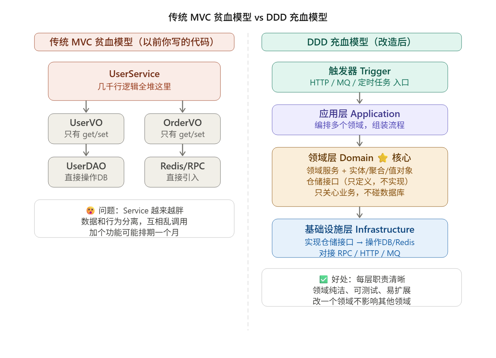

## DDD是什么？

DDD既不是MVC架构，也不是微服务，也不是设计模式

DDD是一套教你怎么切系统，怎么建模的设计方法论

<aside>
💡

就像盖房子，MVC 告诉你要有客厅/卧室/厨房（三层结构），但没告诉你客厅里该放什么、厨房里的电器怎么摆

DDD 就是那套"室内设计规范"，告诉你业务代码该怎么组织

</aside>

## 贫血模型 vs 充血模型


贫血模型代码：

```java
// VO 对象：只有属性，没有任何业务逻辑
class UserVO {
    private String name;
    public String getName() { return name; }
    public void setName(String name) { this.name = name; }
    // 就这些，像个"数据快递盒"
}

// Service：所有业务逻辑全堆这里，又臭又长
class UserService {
    void createUser(UserVO vo) {
        // 校验 name 不能为空
        // 校验手机号格式
        // 生成userId
        // 调用 Redis 缓存
        // 调用 userDao 写库
        // 调用 RPC 发通知
        // ....几百行全在这里
    }
}
```

问题：数据（VO）和行为（Service）完全分离，Service 越来越胖，到处互相调用，改一个功能牵一发动全身。

DDD充血模型代码：

```java
// 对象本身就有业务方法，不只是 get/set
class UserEntity {
    private String name;
    private String phone;
    
    // 对象自己知道怎么校验自己
    public boolean isValid() {
        return name != null && phone.matches("\\d{11}");
    }
    
    // 对象自己能拼缓存 Key
    public String toCacheKey() {
        return "user:" + this.userId;
    }
}
```

充血模型的精髓：**对象不单单装数据，还装行为**

## 实体、值对象、聚合


一次数据库事务的边界：一个事务从哪里开始以及到哪里结束的范围

结合生活类比：

**实体**：有身份证号的人（可以变，但能认出他是谁）

**值对象**：他穿的衣服（换一件就是新的，本身不重要）

**聚合**：一次手术（胳膊、腿、器官一起操作，要么全成功，要么全回滚）

## 仓储和适配器（trigger）

领域层只定义"我要什么"，基础设施层负责"怎么给你”

```java
// 领域层：只定义接口（我需要查用户）
public interface IUserRepository {
    UserEntity queryUser(String userId);  // 返回领域对象，不关心从哪取
}

// 基础设施层：实现接口（具体怎么查，领域层不管）
public class UserRepositoryImpl implements IUserRepository {
    @Resource
    private UserDAO userDAO;  // 这里才碰数据库
    
    @Override
    public UserEntity queryUser(String userId) {
        UserPO po = userDAO.selectById(userId);
        return convert(po);  // PO 转换为领域实体
    }
}
```

**好处**：领域层干净纯粹，想换 MySQL 为 MongoDB？只改基础设施层，领域代码一行不动。

## 整体分层架构

各个分层用“下外卖”对比

| DDD分层 | 类比 | 职责 |
| --- | --- | --- |
| trigger层 | 你在APP点击下单 | http/MQ/定时任务入口，只负责触发 |
| app层 | 外卖平台协调各个部门 | 编排多个领域，组装完整流程 |
| domain层 | 商家接单/备餐的核心业务 | 实体、聚合、领域服务，核心业务逻辑 |
| infrastructure层 | 配送员，仓库，支付通道 | 实现数据存取，RPC调用等操作 |