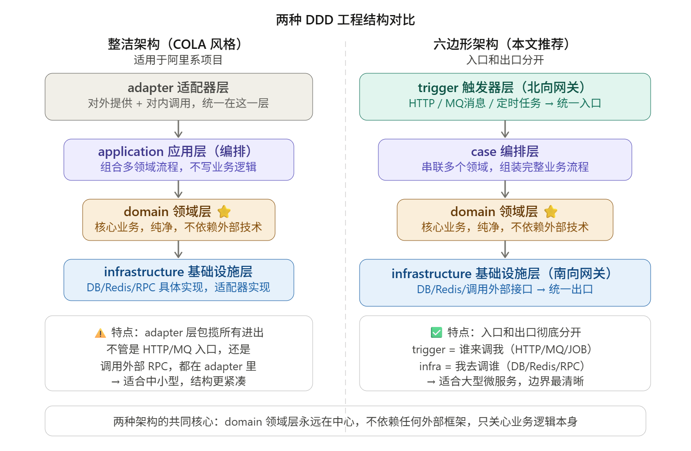

把设计好的领域模型，翻译成真实的Maven多模块工程目录结构，每层放什么代码、每种对象（VO, PO/DTO/Entity）放在哪里，为什么这样放

## 为什么需要架构？

房子隔间类比

代码工程就像买了个房子，需要隔出客厅、卧室、厨房、卫生间。不是法律规定，而是职责要分区

在微服务时代，一个工程要处理的东西太多了，比如

- 数据库连接、Redis缓存、外部RPC调用
- 消息队列监听、定时任务
- 统一异常处理、日志、限流

传统的MVC三层（Controller, Service, Dao）装不下这些，全都往Service里面塞，导致Service文件几千行，就像把马桶、沙发、床都堆在一间房间里，DDD的工程模型就是解决这个问题的

## 两种主流工程结构



## 工程目录


app层：限流、线程池配置，各种环境配置（按照之前的话说，起到编排多个领域，组装完整流程的作用）

trigger层：hppt（controller），mq（消息监听），定时任务

domain层：业务核心

infrastructure层：操作数据库，数据库映射对象，实现domain层的接口，调用外部http/RPC

types层：公共常量，统一返回对象，枚举异常定义

api层：服务类接口定义，出入参对象

## 各种对象（VO/PO/DTO/Entity）到底放哪里？


## domain内部怎么组织

```
xfg-frame-domain/
└── domain/
    ├── order/               ← 订单领域
    │   ├── model/
    │   │   ├── aggregates/  OrderAggregate.java   ← 聚合：订单+明细打包
    │   │   ├── entity/      OrderItemEntity.java   ← 实体：有ID，可变
    │   │   └── valobj/      OrderIdVO.java         ← 值对象：无ID，不可变
    │   ├── repository/
    │   │   └── IOrderRepository.java   ← 仓储接口（只定义，不实现！）
    │   └── service/
    │       └── OrderService.java        ← 领域服务：核心业务逻辑
    │
    ├── rule/                ← 规则引擎领域
    │   ├── model/ ...
    │   ├── repository/ IRule Repository.java
    │   └── service/
    │       ├── engine/      ← 规则树引擎实现
    │       └── logic/       ← 具体规则逻辑（年龄/性别过滤）
    │
    └── user/                ← 用户领域
        ├── model/valobj/    UserVO.java
        ├── repository/      IUserRepository.java
        └── service/         UserService.java
```

**每个领域包 = 一个独立的充血模型**，就像一个小团队：有自己的数据模型、自己的仓库接口、自己的服务实现，互相不干扰。

## AOP切面放哪里

**所有和业务无关的"横切关注点"（限流、日志、权限）全部放在 `xfg-frame-app` 的 `aop/` 目录下**。

```java
// 在 app 模块里配置：所有进入 trigger 的请求，都经过限流检查
@Pointcut("execution(* cn.bugstack.xfg.frame.trigger..*.*(..))")
public void pointCut() {}

// 每秒只允许 1 个请求通过，超过了直接返回限流响应码
```

这样的好处是：**限流逻辑和业务逻辑完全分离**，想改限流策略，直接改 AOP，域里的代码不受影响。