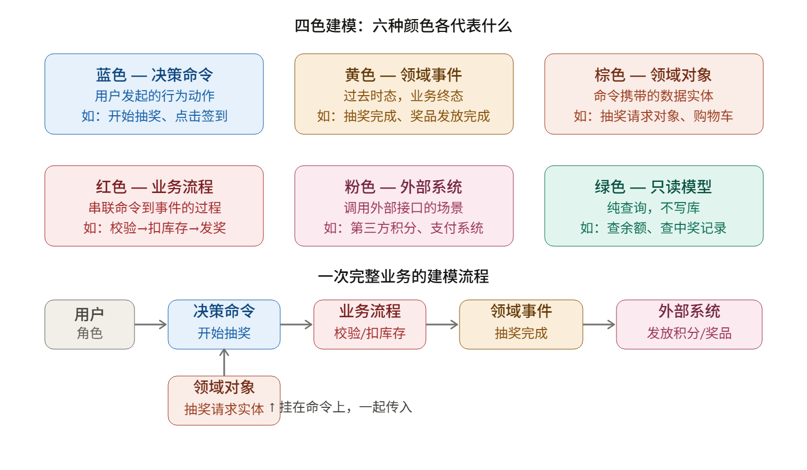

关于如何建模，也就是拿到需求之后，怎么一步步把它拆解成领域

我们拿到需求后，用四色建模，把业务拆成一块一块的领域（domain），再划定每块的边界

## 为什么要建模

建模的好处是让产品、测试、开发、架构师都用**同一套语言**讨论，不会鸡同鸭讲。

例如，建模就像盖楼前要先画蓝图，超市开业前要先规划哪里放蔬菜、哪里放零食

## 四色建模是什么



**用一句话记住四色建模：** 一个用户，带着一个命令（蓝色），拿着数据对象（棕色），经过业务流程（红色），触发一个或多个领域事件（黄色），中途可能调用外部系统（粉色），也可能只是查个数据（绿色）。

## 使用超市举例子


| **现实场景** | **DDD术语** |
| --- | --- |
| 老婆交代买什么 | 决策命令（蓝色）：触发行为的指令 |
| 空购物车 | 领域对象（棕色）：承载数据的实体 |
| 在超市选商品 | 业务流程（红色）：实现命令的过程 |
| 购物车满了 | 领域事件（黄色）：业务完成的终态 |
| 顺手带包烟 | 另一个领域事件（一次命令可能触发多个事件） |
| 打车回家 | 下一个领域（领域之间通过编排串联） |

## 真实业务案例的五步建模流程

以抽奖营销系统为例子


那么划分领域边界的结果可视化为


## 建模的核心思路

<aside>
💡

以结果（领域事件）为导向，倒推所需的命令、对象和流程。

</aside>

也就是说，正常开发时你会想"用户点了什么，然后我写个 if-else 处理"；而 DDD 建模是先问："这件事最终要完成到什么状态？（领域事件）"，再倒推"需要哪些步骤、对象、外部系统才能到达这个状态”

```
读 PRD → 画用例图 → 贴黄色便利贴（穷举事件）
       → 给事件配上命令+对象+流程 → 圈出领域边界
                                         ↓
                          对应代码里 domain 下的各个子包
```