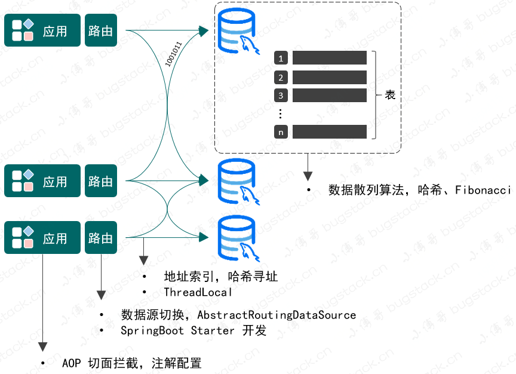

## 为什么分库分表？

单库单表在数据量激增后会遇到以下瓶颈：

- 单表数据量过大，查询性能下降（索引失效、全表扫描）
- 单个数据库连接数有限，并发能力不足
- 单机磁盘 I/O 成为瓶颈

### 两种拆分方式

| **拆分方式** | **定义** | **场景** |
| --- | --- | --- |
| **垂直拆分** | 按业务拆分不同的表到不同库，"专库专用" | 业务模块边界清晰，如用户库、订单库、商品库 |
| **水平拆分** | 同一张表拆分到多个库/多张表，结构相同 | 单表数据量极大，如用户表 user_01 ~ user_04 |

> 💡 **类比理解**：垂直拆分像"按部门分楼层"，水平拆分像"同一部门按员工编号分到多个办公室"。
> 

本文实现的是**水平拆分**的路由设计。



## 整体设计思路

实现一个分库分表路由组件需要解决四个核心问题：

```
1. 如何标记哪些方法需要路由？          → 自定义注解 + AOP 拦截
2. 数据应该落到哪个库哪张表？          → 散列算法（哈希寻址）
3. 如何切换不同的数据库连接？          → 动态数据源（DynamicDataSource）
4. 路由结果如何在方法调用链中传递？    → ThreadLocal
```

---

## **技术原理详解**

### **散列算法 —— 如何让数据均匀分布？**

路由的核心目标是让用户数据**均匀地**落到各库各表，而不是全挤在某一个地方。

**方案一：ThreadLocal 的斐波那契散列**

`ThreadLocal` 内部使用黄金分割数 `0x61c88647` 进行散列，效果极好：

参考ThreadLocal的实现思路


```java
@Test
public void test_idx() {
    int hashCode = 0;
    for (int i = 0; i < 16; i++) {
        hashCode = i * 0x61c88647 + 0x61c88647;
        int idx = hashCode & 15;
        System.out.println("斐波那契散列：" + idx + " 普通散列：" + (String.valueOf(i).hashCode() & 15));
    }
} 

斐波那契散列：7 普通散列：0
斐波那契散列：14 普通散列：1
斐波那契散列：5 普通散列：2
斐波那契散列：12 普通散列：3
斐波那契散列：3 普通散列：4
斐波那契散列：10 普通散列：5
斐波那契散列：1 普通散列：6
斐波那契散列：8 普通散列：7
斐波那契散列：15 普通散列：8
斐波那契散列：6 普通散列：9
斐波那契散列：13 普通散列：15
斐波那契散列：4 普通散列：0
斐波那契散列：11 普通散列：1
斐波那契散列：2 普通散列：2
斐波那契散列：9 普通散列：3
斐波那契散列：0 普通散列：4

```

Fibonacci 散列法可以让数据更加分散，在发生数据碰撞时进行开放寻址，从碰撞节点向后寻找位置进行存放元素

**方案二：HashMap 的扰动函数（本组件采用）**

HashMap底层是数组，链表和红黑树


```java
// 参考 HashMap 的扰动函数，让哈希值更分散
public static int disturbHashIdx(String key, int size) {
    return (size - 1) & (key.hashCode() ^ (key.hashCode() >>> 16));
}
```

<aside>
💡

**为什么要 `^ (hashCode >>> 16)`？**

字符串的 hashCode 低位碰撞概率较高，将高16位混入低位运算，可以让不同 key 的结果更分散，避免数据扎堆。

</aside>

### 路由寻址**—— 如何确定具体的库和表？**

假设有 **2个库 × 4张表 = 8个槽位**，类比 HashMap 的 8格桶。

```
总槽位数 size = dbCount × tbCount = 2 × 4 = 8

对 userId 做散列：
idx = (8 - 1) & (userId.hashCode() ^ (userId.hashCode() >>> 16))
idx 范围：0 ~ 7

然后折算到库表：
dbIdx（库编号）  = idx / tbCount + 1       // 落在第几库
tbIdx（表编号）  = idx - tbCount * (dbIdx - 1) // 落在第几表
```

**举例：** idx = 5，tbCount = 4

```
dbIdx = 5 / 4 + 1 = 2   → 第 2 库
tbIdx = 5 - 4 * (2-1) = 1 → 第 1 表
```

最终路由到：`bugstack_02` 库的 `user_01` 表。

### **ThreadLocal —— 路由信息如何传递？**

AOP 切面计算出 `dbIdx` 和 `tbIdx` 后，不能直接传参（MyBatis 的接口不支持），需要用 ThreadLocal 在**同一个线程内**传递数据。

```java
// DBContextHolder：封装 ThreadLocal 的工具类
public class DBContextHolder {

    // 存储当前线程要用的库编号
    private static final ThreadLocal<String> dbKey = new ThreadLocal<>();
    // 存储当前线程要用的表编号
    private static final ThreadLocal<String> tbKey = new ThreadLocal<>();

    public static void setDBKey(String db) { dbKey.set(db); }
    public static String getDBKey()        { return dbKey.get(); }
    public static void clearDBKey()        { dbKey.remove(); }

    public static void setTBKey(String tb) { tbKey.set(tb); }
    public static String getTBKey()        { return tbKey.get(); }
    public static void clearTBKey()        { tbKey.remove(); }
}
```

<aside>
💡

用完必须clear()，否则线程池环境下线程复用会导致脏数据

</aside>

### 动态数据源**—— 如何切换数据库连接？**

Spring 提供了 `AbstractRoutingDataSource`，它可以维护多个数据源，并通过一个"路由 key"来决定当前使用哪个。

```java
public class DynamicDataSource extends AbstractRoutingDataSource {

    @Override
    protected Object determineCurrentLookupKey() {
        // 从 ThreadLocal 中读取当前线程设置的库编号
        return DBContextHolder.getDBKey();
    }
}
```

<aside>
💡

`AbstractRoutingDataSource` 内部维护了一个 `Map<Object, DataSource>` 的`targetDataSources`。每次获取连接前，会调用 `determineCurrentLookupKey()` 拿到 key，再查这个 Map 找到对应数据源。因此我们只需在 ThreadLocal 里存好 key，Spring 自动完成连接切换。

</aside>

## 完整实现流程

### **自定义路由注解**

```java
@Documented
@Retention(RetentionPolicy.RUNTIME)
@Target({ElementType.TYPE, ElementType.METHOD})
public @interface DBRouter {
    // 路由依据字段名，如 "userId"
    String key() default "";
}
```

使用方式（加在 Mapper 接口的方法上）：

```java
@Mapper
public interface IUserDao {

    @DBRouter(key = "userId")
    User queryUserInfoByUserId(User req);

    @DBRouter(key = "userId")
    void insertUser(User req);
}
```

---

### **读取配置（EnvironmentAware）**

配置文件结构（application.yml）：

```yaml
router:
  jdbc:
    datasource:
      dbCount:2       # 分了几个库
      tbCount:4       # 每个库几张表
      list:db01,db02  # 数据源名称列表
      db01:
        driver-class-name:com.mysql.cj.jdbc.Driver
        url:jdbc:mysql://localhost:3306/bugstack_01
        username:root
        password:123456
      db02:
        driver-class-name:com.mysql.cj.jdbc.Driver
        url:jdbc:mysql://localhost:3306/bugstack_02
        username:root
        password:123456
```

读取配置（实现 `EnvironmentAware`，在 Spring 初始化时自动注入 Environment）：

```java
@Override
public void setEnvironment(Environment environment) {
    String prefix = "router.jdbc.datasource.";

    dbCount = Integer.valueOf(environment.getProperty(prefix + "dbCount"));
    tbCount = Integer.valueOf(environment.getProperty(prefix + "tbCount"));

    String dataSources = environment.getProperty(prefix + "list");
    for (String dbInfo : dataSources.split(",")) {
        Map<String, Object> props = PropertyUtil.handle(environment, prefix + dbInfo, Map.class);
        dataSourceMap.put(dbInfo, props);
    }
}
```

---

### **创建动态数据源 Bean**

```java
@Bean
public DataSource dataSource() {
    Map<Object, Object> targetDataSources = new HashMap<>();

    for (String dbInfo : dataSourceMap.keySet()) {
        Map<String, Object> props = dataSourceMap.get(dbInfo);
        targetDataSources.put(dbInfo, new DriverManagerDataSource(
            props.get("url").toString(),
            props.get("username").toString(),
            props.get("password").toString()
        ));
    }

    DynamicDataSource dynamicDataSource = new DynamicDataSource();
    dynamicDataSource.setTargetDataSources(targetDataSources);
    return dynamicDataSource;  // 数据源靠它动态配置
}
```

---

### **AOP 切面 —— 核心路由逻辑**

```java
@Around("aopPoint() && @annotation(dbRouter)")
public Object doRouter(ProceedingJoinPoint jp, DBRouter dbRouter) throws Throwable {
    String dbKey = dbRouter.key(); // 取注解中的 key，如 "userId"
    if (StringUtils.isBlank(dbKey)) {
        throw new RuntimeException("annotation DBRouter key is null！");
    }

    // 1. 从方法入参中取出路由 key 对应的值
    String dbKeyAttr = getAttrValue(dbKey, jp.getArgs());

    // 2. 计算总槽位数（类比 HashMap 的容量）
    int size = dbRouterConfig.getDbCount() * dbRouterConfig.getTbCount();

    // 3. 扰动函数：让散列更均匀（同 HashMap 原理）
    int idx = (size - 1) & (dbKeyAttr.hashCode() ^ (dbKeyAttr.hashCode() >>> 16));

    // 4. 折算到库编号和表编号
    int dbIdx = idx / dbRouterConfig.getTbCount() + 1;
    int tbIdx = idx - dbRouterConfig.getTbCount() * (dbIdx - 1);

    // 5. 存入 ThreadLocal，供后续数据源切换和 SQL 中使用
    DBContextHolder.setDBKey(String.format("%02d", dbIdx)); // 如 "01", "02"
    DBContextHolder.setTBKey(String.format("%02d", tbIdx));

    try {
        return jp.proceed(); // 执行原方法
    } finally {
        // 6. 清理 ThreadLocal，防止线程复用导致脏数据
        DBContextHolder.clearDBKey();
        DBContextHolder.clearTBKey();
    }
}
```

---

### **4.5 MyBatis SQL 配置**

表名用 `${tbIdx}` 占位符动态拼接（从 ThreadLocal 中读取）：

```xml
<select id="queryUserInfoByUserId"
        parameterType="cn.bugstack.middleware.test.infrastructure.po.User"
        resultType="cn.bugstack.middleware.test.infrastructure.po.User">
    SELECT id, userId, userNickName, userHead, userPassword, createTime
    FROM user_${tbIdx}
    WHERE userId = #{userId}
</select>

<insert id="insertUser" parameterType="...">
    INSERT INTO user_${tbIdx} (id, userId, userNickName, ...)
    VALUES (#{id}, #{userId}, #{userNickName}, ...)
</insert>
```

> ⚠️ 注意区分 `${}` 和 `#{}`：
> 
> - `${tbIdx}`：直接字符串替换，用于表名等结构部分（不能防 SQL 注入，但表名场景没有注入风险）
> - `#{userId}`：预编译参数，用于 WHERE 条件值（防 SQL 注入）

---

### **4.6 数据库建表**

```
-- 库1
CREATE DATABASE `bugstack_01`;
USE bugstack_01;

CREATE TABLE user_01 ( ... );
CREATE TABLE user_02 ( ... );
CREATE TABLE user_03 ( ... );
CREATE TABLE user_04 ( ... );

-- 库2（结构相同）
CREATE DATABASE `bugstack_02`;
USE bugstack_02;

CREATE TABLE user_01 ( ... );
-- ...
```

---

## **五、完整调用链路图**

```
请求进入（带 userId）
        │
        ▼
  @DBRouter 注解方法
        │
        ▼
  AOP 切面拦截
        │
        ├─── 从参数提取 userId 值
        ├─── 计算散列 idx
        ├─── 折算 dbIdx / tbIdx
        └─── 写入 ThreadLocal
        │
        ▼
  DynamicDataSource.determineCurrentLookupKey()
        │
        ├─── 从 ThreadLocal 读 dbIdx
        └─── 返回对应数据源（如 "db02"）
        │
        ▼
  MyBatis 执行 SQL
        │
        ├─── ${tbIdx} 从 ThreadLocal 读表编号
        └─── 最终执行：bugstack_02.user_01
        │
        ▼
  AOP finally 块清理 ThreadLocal
```

---

## **六、关键技术总结**

| **技术点** | **作用** | **关键类/接口** |
| --- | --- | --- |
| 自定义注解 | 标记需要路由的方法 | `@DBRouter` |
| AOP 环绕切面 | 拦截方法，计算路由，设置 ThreadLocal | `@Around` |
| 扰动散列函数 | 让数据均匀分布到各库表 | `hashCode ^ (hashCode >>> 16)` |
| ThreadLocal | 在线程内传递库表索引 | `DBContextHolder` |
| AbstractRoutingDataSource | Spring 动态数据源切换 | `DynamicDataSource` |
| EnvironmentAware | 读取自定义配置 | `setEnvironment()` |
| MyBatis `${}` 占位符 | 动态拼接表名 | `user_${tbIdx}` |