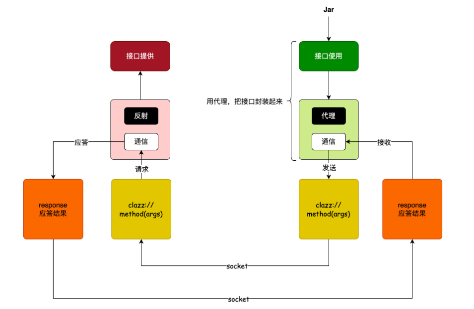

### 为什么用Dubbo

从单体到微服务，通信成了问题

系统拆分后（用户 / 支付 / 商品 / 活动…），服务之间需要高效通信。Dubbo 的底层是 **Socket**，而非 HTTP，天然更快。

- 比 HTTP 通信性能更好（二进制协议，长连接）
- 内置分布式高可用：实例宕机后自动从注册中心摘除，流量自动切换
- 与 Zookeeper 配合实现服务发现与负载均衡

**接口的提供方**

- 定义接口 + 出入参（DTO），需实现 Serializable
- 实现类用 @DubboService，不要用 Spring 的 @Service
- 配置 scan.base-packages 指向 API 模块
- 需执行 Maven install 将 Jar 推入本地仓库

**接口的调用方**

- POM 引入 Provider 的 API Jar
- 注册中心模式：@DubboReference(version="1.0.0")
- 直连模式：url="dubbo://127.0.0.1:20881”
- 用于本地调试，无需真实 Zookeeper

四大常见坑：

- **坑1 — 忘记 Serializable：**所有出入参（含泛型、包装类）都必须实现 Serializable，漏一个就报序列化异常
- **坑2 — 注解用错：**实现类要用 @DubboService，用了 Spring 的 @Service 不会被 Dubbo 接管，接口暴露失败
- **坑3 — 包名扫描覆盖问题：**base-packages 必须能被 Application 包名覆盖到；POM 也要直接/间接引入 API 模块
- **坑4 — 没有 Maven Install：**Provider 改动后，Consumer 引用的是旧 Jar。需要先 clean 再 install

### 底层原理

两件事：反射 + 代理

**消费方（代理）：**用 JDK Proxy + FactoryBean 包装接口，注入 Spring 容器；调用时把 clazz/method/args 打包，通过 Netty Socket 发出去

**提供方（反射）：**Netty 服务端接收请求，解析出接口信息，通过 method.invoke() 反射调用对应 Bean，结果写回 Socket

<aside>
💡

Dubbo 的本质是 **RPC = 远程方法调用的本地化封装**。你写的代码像调本地方法，底层悄悄走了一次网络往返。

Jar 包之所以要共享，是因为动态代理需要接口的 Class 信息（方法签名、参数类型），没有 Jar 就无法生成代理对象。

注册中心（Zookeeper）扮演"黄页"角色：Provider 上线时写入地址，Consumer 查询地址，宕机时自动摘除。直连模式绕过它，适合本地调试。

</aside>

[Dubbo](https://bugstack.cn/md/road-map/dubbo.html)