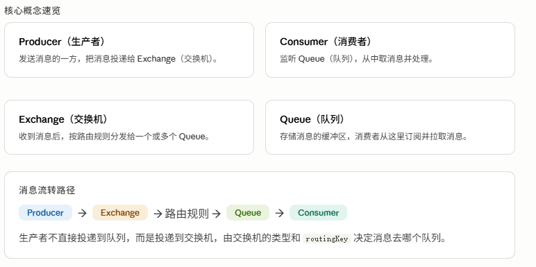

## RabbitMQ是什么

**RabbitMQ** 是一款基于 **AMQP**（高级消息队列协议）的开源消息中间件，由 **Erlang** 语言开发。

它的核心价值是实现系统间的**异步通信与解耦**——生产者发完消息就不管了，消费者按自己的节奏去取。



## 为什么要用MQ（使用场景）


## 环境安装

使用docker安装

```yaml
# docker-compose.yml
version: '3'
services:
  rabbitmq:
    image: rabbitmq:3-management   # 带管理后台的镜像
    container_name: rabbitmq
    ports:
      - "5672:5672"    # 消息通信端口
      - "15672:15672"  # 管理后台端口
    environment:
      RABBITMQ_DEFAULT_USER: admin
      RABBITMQ_DEFAULT_PASS: admin
```

<aside>
💡

启动命令：`docker-compose up -d`

管理后台：**http://localhost:15672**　账号/密码：admin / admin

</aside>

## 配置主题

登录 RabbitMQ 管理后台：[**http://127.0.0.1:15672/#/ (opens new window)**](http://127.0.0.1:15672/#/)- `账密：admin/admin`


## 集成Spring Boot

**添加依赖**

```xml
<dependency>
    <groupId>org.springframework.boot</groupId>
    <artifactId>spring-boot-starter-amqp</artifactId>
</dependency>
```

**在application-dev.yml中配置**

```yaml
spring:
  rabbitmq:
    addresses: 127.0.0.1
    port: 5672
    username: admin
    password: admin
    listener:
      simple:
        prefetch: 1  # 每次投递1条，消费完再投递下一条
```

**prefetch** 是流量控制关键参数：设为 1 代表每次只给消费者推 1 条消息，处理完再推。生产环境可适当调大（如 10~50）以提升吞吐量。

## 四种消息模式详解


### 普通消息（点对点）

消息投递到 Queue，被**一个消费者**取走处理。适合任务分发场景。

消费者

```java
@RabbitListener(queuesToDeclare = @Queue(value = "testQueue"))
public void listener(String msg) {
    log.info("接收消息：{}", msg);
    // 如果抛异常，RabbitMQ 会重新投递（可用于测试重试机制）
}
```

生产者发送

```java
// 直接向队列名发送，不经过自定义 Exchange
rabbitTemplate.convertAndSend("testQueue", "Hello, RabbitMQ!");
```

### 广播消息

Exchange 类型为 **FANOUT**，消息**广播到所有绑定的队列**，每个消费者都能收到同一条消息。routingKey 无效（填空串即可）。

消费者

```java
@RabbitListener(
    bindings = @QueueBinding(
        value = @Queue(value = "fanoutQueue"),
        exchange = @Exchange(
            value = "fanoutExchange",
            type = ExchangeTypes.FANOUT  // 广播类型
        )
    )
)
public void listener(String msg) {
    log.info("接收广播消息：{}", msg);
}
```

生产者发送

```java
// 第二个参数 routingKey 在 FANOUT 下无效，传空串
rabbitTemplate.convertAndSend("fanoutExchange", "", "这是广播消息");
```

### 路由消息

Exchange 类型为 **DIRECT**，消息按**精确匹配的 routingKey** 投递到对应队列。不同消费者绑定不同的 key，各取各的消息。

消费者（两个listener绑定不同的key）

```java
// 只接收 routeKey1 的消息
@RabbitListener(bindings = @QueueBinding(
    value = @Queue("routeQueue1"),
    exchange = @Exchange(value = "routeExchange", type = ExchangeTypes.DIRECT),
    key = "routeKey1"
))
public void listener01(String msg) { ... }

// 只接收 routeKey2 的消息
@RabbitListener(bindings = @QueueBinding(
    value = @Queue("routeQueue2"),
    exchange = @Exchange(value = "routeExchange", type = ExchangeTypes.DIRECT),
    key = "routeKey2"
))
public void listener02(String msg) { ... }
```

生产者发送

```java
// 发给 routeKey1 → 只有 listener01 收到
rabbitTemplate.convertAndSend("routeExchange", "routeKey1", "给1号处理器的消息");
// 发给 routeKey2 → 只有 listener02 收到
rabbitTemplate.convertAndSend("routeExchange", "routeKey2", "给2号处理器的消息");
```

## 通配符消息

Exchange 类型为 **TOPIC**，routingKey 支持通配符过滤，是功能最灵活的模式。

**`*` ：**匹配**一个**单词（段），如 `topic.*` 能匹配 `topic.x` 但不能匹配 `topic.x.y`

`#`：匹配**零个或多个**单词，如 `topic.#` 能匹配 `topic.x`、`topic.x.y.z`

消费者配置

```java
// listener01: topic.* → 只匹配一级，如 topic.x
@RabbitListener(bindings = @QueueBinding(
    value = @Queue("topicQueue1"),
    exchange = @Exchange(value = "topicExchange", type = ExchangeTypes.TOPIC),
    key = "topic.*"
))
public void listener01(String msg) { ... }

// listener02: topic.# → 匹配所有以 topic. 开头的 key
@RabbitListener(bindings = @QueueBinding(
    value = @Queue("topicQueue2"),
    exchange = @Exchange(value = "topicExchange", type = ExchangeTypes.TOPIC),
    key = "topic.#"
))
public void listener02(String msg) { ... }

// listener03: topic.y.# → 只匹配以 topic.y. 开头的 key
@RabbitListener(bindings = @QueueBinding(
    value = @Queue("topicQueue3"),
    exchange = @Exchange(value = "topicExchange", type = ExchangeTypes.TOPIC),
    key = "topic.y.#"
))
public void listener03(String msg) { ... }
```

发送消息与接收结果验证

```java
// 发送 "topic.x" → listener01 (topic.*) 收到，listener02 (topic.#) 收到
rabbitTemplate.convertAndSend("topicExchange", "topic.x", "消息1");

// 发送 "topic.y.z" → listener02 (topic.#) 收到，listener03 (topic.y.#) 收到
// listener01 (topic.*) 不收——因为 topic.y.z 有两级，* 只匹配一级
rabbitTemplate.convertAndSend("topicExchange", "topic.y.z", "消息2");
```

## 消息重试机制

当消费者抛出异常时，RabbitMQ 会将消息**重新入队并重新投递**（Requeue），消费者会再次收到这条消息，直到消费成功或被移入死信队列。

```java
@RabbitListener(queuesToDeclare = @Queue(value = "testQueue"))
public void listener(String msg) {
    log.info("接收消息：{}", msg);
    // 取消注释后，该消息会不断重试，可在控制台观察重试日志
    // throw new RuntimeException("模拟消费失败，触发重试");
}
```

<aside>
💡

生产环境应配置最大重试次数 + 死信队列（DLQ），防止消息无限循环消费，造成资源浪费。

</aside>

**关于注解的工作原理**

`@RabbitListener` 加了 `bindings` 属性后，Spring 启动时会**自动创建 Exchange、Queue 并完成绑定**，不需要手动去管理后台配置——管理后台主要用于监控和手动操作。

---

**关于四种模式的选型思路**

- 普通消息：最常用，发任务给某个处理器
- Fanout：需要"通知所有人"时用，比如缓存失效广播
- Direct：需要"精确分流"时用，比如不同支付渠道走不同处理器
- Topic：需要"按规则过滤"时用，比如日志系统按 `log.error.#` / `log.info.*` 分级存储

---

**与 RocketMQ 的主要区别**

| 维度 | RabbitMQ | RocketMQ |
| --- | --- | --- |
| 协议 | AMQP | 自研协议 |
| 路由能力 | 很强（4种Exchange） | 相对简单 |
| 吞吐量 | 中等 | 高 |
| 管理后台 | 自带，开箱即用 | 需要额外部署 |
| 适合场景 | 复杂路由、中小规模 | 高并发、大数据量 |

结合DDD 项目实践，消费者通常放在 `trigger` 层（基础设施的入站适配器），生产者调用封装在 `infrastructure` 层，保持领域层不依赖 MQ 具体实现