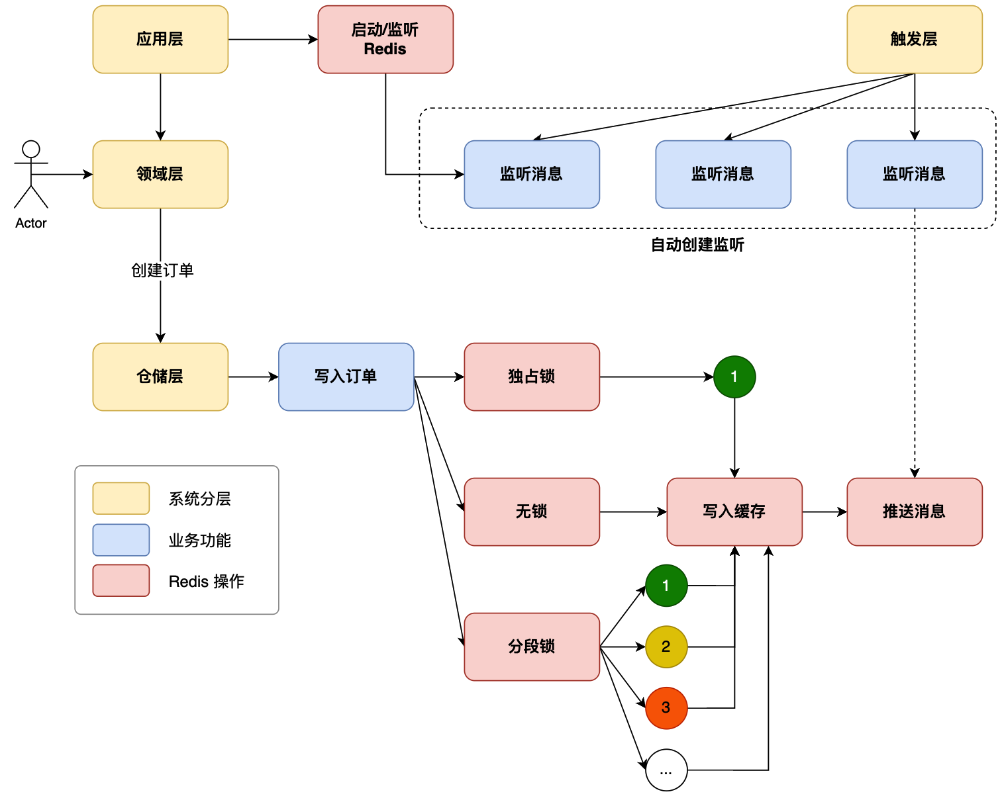

## **Redis 是什么？为什么用它？**

### **定义**

Redis（**Re**mote **Di**ctionary **S**erver）是一个**开源的内存数据存储**，数据保存在内存中，读写速度极快（微秒级），同时也支持持久化到磁盘。

### **在 Java 后端中的典型用途**

| **场景**               | **说明**                                      |
| ---------------------- | --------------------------------------------- |
| **缓存数据库查询结果** | 避免每次请求都打到 MySQL，大幅提升 QPS        |
| **分布式锁**           | 多个服务实例之间协调，防止重复处理            |
| **布隆过滤器**         | 防止缓存穿透，先用布隆过滤器过滤非法 key      |
| **发布 / 订阅**        | 解耦业务流程，如订单创建后通知下游服务        |
| **延迟队列**           | 低延迟任务调度，如超时取消订单                |
| **计数器 / 库存扣减**  | 原子性的 `INCR` / `DECR` 操作，无需加数据库锁 |
| **规则引擎**           | 将规则数据放内存，实现高速判断                |

### **Redis vs MySQL 一句话区别**

> MySQL 是**硬盘数据库**，数据持久但慢；Redis 是**内存数据库**，速度极快但（默认情况下）重启数据会丢。两者互补，Redis 挡在前面做缓存，MySQL 在后面保证数据可靠。

---

## **环境安装**

文章使用 Docker Compose 一键安装 MySQL + Redis，配置文件位于工程的 `docs/dev-ops` 目录下。

```yaml
# docker-compose.yml 示例片段（简化）
version:'3'
services:
  redis:
    image:redis:6.2
    ports:
      -"6379:6379"
    volumes:
      -./redis.conf:/etc/redis/redis.conf
    command:redis-server /etc/redis/redis.conf
```

推荐可视化工具：

- [AnotherRedisDesktopManager](https://github.com/qishibo/AnotherRedisDesktopManager/releases)（免费，跨平台）
- [RedisInsight](https://redis.io/docs/ui/insight/)（官方出品）

## **SpringBoot 集成配置**

文章使用 **Redisson** 而不是 Spring 自带的 `spring-data-redis(RedisTemplate)`，原因是 Redisson 封装了更丰富的分布式特性（锁、队列、布隆过滤器等）。

### **Maven 依赖**

```xml
<dependency>
    <groupId>org.redisson</groupId>
    <artifactId>redisson-spring-boot-starter</artifactId>
    <version>3.23.1</version>
</dependency>
```

### **自定义配置项（application.yml）**

```yaml
redis:
  sdk:
    config:
      host:localhost
      port:6379
      password:123456
      pool-size:10          # 连接池最大连接数
      min-idle-size:5       # 连接池最小空闲连接数
      idle-timeout:30000    # 空闲连接超时（ms）
      connect-timeout:5000  # 连接超时（ms）
      retry-attempts:3      # 失败重试次数
      retry-interval:1000   # 重试间隔（ms）
      ping-interval:60000   # 心跳间隔（ms）
      keep-alive:true
```

> **为什么不用 Spring 自带的 `spring.redis.*` 配置？**
> 主要是为了**版本兼容性**和**功能扩展**。通过自定义配置类 `RedisClientConfigProperties` + `RedisClientConfig`，可以灵活控制 Redisson 客户端的创建过程，也方便后续添加集群模式、哨兵模式等。

### **创建 RedissonClient Bean**

```java
@Configuration
@EnableConfigurationProperties(RedisClientConfigProperties.class)
public class RedisClientConfig {

    @Bean
    public RedissonClient redissonClient(
            ConfigurableApplicationContext applicationContext,
            RedisClientConfigProperties properties) {

        Config config = new Config();
        // 单节点模式
        config.useSingleServer()
            .setAddress("redis://" + properties.getHost() + ":" + properties.getPort())
            .setPassword(properties.getPassword())
            .setConnectionPoolSize(properties.getPoolSize())
            .setConnectionMinimumIdleSize(properties.getMinIdleSize())
            .setIdleConnectionTimeout(properties.getIdleTimeout())
            .setConnectTimeout(properties.getConnectTimeout())
            .setRetryAttempts(properties.getRetryAttempts())
            .setRetryInterval(properties.getRetryInterval())
            .setPingConnectionInterval(properties.getPingInterval())
            .setKeepAlive(properties.isKeepAlive());

        RedissonClient redissonClient = Redisson.create(config);

        // ... 此处还会处理发布/订阅的自动注册（见第七节）

        return redissonClient;
    }
}
```

### **封装 RedissonService（IRedisService 接口）**

建议将 Redisson 的常用操作封装成一个 Service，避免直接散落在业务代码各处：

```java
@Service
public class RedissonService implements IRedisService {

    @Resource
    private RedissonClient redissonClient;

    /** 设置缓存值（永久有效） */
    @Override
    public <T> void setValue(String key, T value) {
        redissonClient.<T>getBucket(key).set(value);
    }

    /** 设置缓存值（带过期时间） */
    @Override
    public <T> void setValue(String key, T value, long expired, TimeUnit unit) {
        redissonClient.<T>getBucket(key).set(value, expired, unit);
    }

    /** 获取缓存值 */
    @Override
    public <T> T getValue(String key) {
        return redissonClient.<T>getBucket(key).get();
    }

    /** 原子递减（用于库存扣减） */
    @Override
    public long decr(String key) {
        return redissonClient.getAtomicLong(key).decrementAndGet();
    }

    /** 原子递增 */
    @Override
    public long incr(String key) {
        return redissonClient.getAtomicLong(key).incrementAndGet();
    }

    /** 获取锁对象 */
    @Override
    public RLock getLock(String key) {
        return redissonClient.getLock(key);
    }

    /** 获取 Topic（发布/订阅） */
    @Override
    public <T> RTopic getTopic(String topic) {
        return redissonClient.getTopic(topic);
    }
}
```

---

## **数据缓存（Cache）**

### **缓存的基本思路**

```
请求进来
  │
  ├─ 先查 Redis 缓存 ──► 有数据 ──► 直接返回（快！）
  │
  └─ 缓存没有 ──► 查 MySQL ──► 写入 Redis ──► 返回
```

### **代码示例（订单查询场景）**

```java
// infrastructure 层 - OrderRepository.java

@Override
public String createOrder(OrderAggregate orderAggregate) {
    // 1. 写库
    UserOrderPO userOrderPO = buildUserOrderPO(orderAggregate);
    userOrderDao.insert(userOrderPO);

    // 2. 写缓存（写库成功后同步缓存）
    OrderEntity orderEntity = buildOrderEntity(orderAggregate, orderId);
    redissonService.setValue(orderId, orderEntity);

    return orderId;
}

@Override
public OrderEntity queryOrder(String orderId) {
    // 1. 先查缓存
    OrderEntity orderEntity = redissonService.getValue(orderId);

    if (null == orderEntity) {
        // 2. 缓存没有，查数据库
        UserOrderPO userOrderPO = userOrderDao.selectByOrderId(orderId);
        orderEntity = new OrderEntity();
        orderEntity.setUserName(userOrderPO.getUserName());
        orderEntity.setUserId(userOrderPO.getUserId());

        // 3. 回写缓存
        redissonService.setValue(orderId, orderEntity);
    }
    return orderEntity;
}
```

### **缓存三大问题**

| **问题**     | **原因**                                                     | **解决方案**                                     |
| ------------ | ------------------------------------------------------------ | ------------------------------------------------ |
| **缓存穿透** | 查询一个数据库中**根本不存在**的 key，缓存永远没有，每次都打到 DB | 布隆过滤器（`RBloomFilter`）提前过滤；或缓存空值 |
| **缓存击穿** | 某个**热点 key 过期**的瞬间，大量并发请求同时打到 DB         | 加互斥锁（Mutex Lock），只让一个线程去加载缓存   |
| **缓存雪崩** | 大量 key 在**同一时间过期**，导致 DB 被瞬间压垮              | 过期时间加随机值，避免同时失效                   |

---

## **分布式锁**

### **为什么需要分布式锁？**

单机 Java 程序用 `synchronized` 或 `ReentrantLock` 就能保证线程安全，但在**多服务器部署**的分布式系统中，不同机器上的 JVM 是相互独立的，本地锁失效。需要一个所有服务器都能访问的"共享锁"——Redis 就是这个角色。

### **独占锁（Exclusive Lock）**

所有请求共用**同一把锁**，串行执行。

```java
@Override
public String createOrderByLock(OrderAggregate orderAggregate) {
    // 锁的 key 以 SKU 商品编号区分，不同商品互不影响
    RLock lock = redissonService.getLock(
        "create_order_lock_" + orderAggregate.getSkuEntity().getSku()
    );
    try {
        lock.lock();  // 阻塞等待获取锁

        // 原子递减库存
        long decrCount = redissonService.decr(orderAggregate.getSkuEntity().getSku());
        if (decrCount < 0) {
            return "已无库存";
        }
        return createOrder(orderAggregate);

    } finally {
        lock.unlock();  // 必须在 finally 中释放锁
    }
}
```

**缺点**：所有用户排队等同一把锁，并发越高等待越长，吞吐量低（测试中耗时约 **106ms**）。

### **分段锁 / 无锁化（Segmented Lock）**

利用 Redis 原子递减（`DECR`）把"争抢库存"本身变成无锁操作，每个用户拿到一个**唯一的库存位**，然后对这个唯一位加锁——本质上每个用户锁的 key 都不同，互不阻塞。

```java
@Override
public String createOrderByNoLock(OrderAggregate orderAggregate) {
    String sku = orderAggregate.getSkuEntity().getSku();

    // Step 1: 原子递减库存，decrCount 是这个用户"拿到"的库存位编号
    // 例如库存 100，第一个用户拿到 99，第二个拿到 98，依此类推
    long decrCount = redissonService.decr(sku);  // 原子性，保证不会超卖
    if (decrCount < 0) {
        return "已无库存";
    }

    // Step 2: 用 "sku_库存位编号" 作为锁 key，每个用户的锁 key 都唯一
    String lockKey = sku + "_" + decrCount;
    RLock lock = redissonService.getLock(lockKey);
    try {
        lock.lock();
        return createOrder(orderAggregate);
    } finally {
        lock.unlock();
    }
}
```

**类比理解**：就像超市取号排队，每人取一个号（`DECR`），然后只需要等自己那个号的柜台，而不是所有人挤一个柜台。



### **两种锁的性能对比**

| **方案**         | **平均耗时（10000并发）** | **适用场景**               |
| ---------------- | ------------------------- | -------------------------- |
| 无锁（直接入库） | ~4ms                      | 无资源竞争                 |
| 独占锁           | ~106ms                    | 防重复提交、低并发串行业务 |
| 分段锁 / 无锁化  | ~4ms                      | 高并发库存扣减、秒杀       |

### **其他锁类型（Redisson 提供）**

```java
// 读写锁（读读不互斥，读写/写写互斥）
RReadWriteLock rwLock = redissonClient.getReadWriteLock("myLock");
rwLock.readLock().lock();
rwLock.writeLock().lock();

// 尝试加锁（不阻塞，拿不到立即返回 false）
boolean locked = lock.tryLock(100, 10, TimeUnit.SECONDS); // 等待100s，锁持有10s

// 信号量（限制并发数量，如同时最多10个请求进来）
RSemaphore semaphore = redissonClient.getSemaphore("mySemaphore");
semaphore.acquire();   // 获取一个许可
semaphore.release();   // 释放一个许可
```

---

## **发布 / 订阅（Pub/Sub）**

### **概念**

Redis 的 Pub/Sub 是一种**消息广播机制**：发布者把消息发到某个频道（Topic），所有订阅了这个频道的订阅者都能收到消息。

```
发布者(Publisher)  ──publish──►  Redis Topic  ──broadcast──►  订阅者A
                                               ──broadcast──►  订阅者B
```

### **最简单的用法**

```java
RedissonClient redisson = Redisson.create();

// 获取一个 Topic
RTopic topic = redisson.getTopic("myTopic");

// 订阅：添加监听器
topic.addListener(String.class, (channel, msg) -> {
    System.out.println("收到消息: " + msg);
});

// 发布消息
topic.publish("Hello, Redis!");

redisson.shutdown();
```

### **在 Spring 项目中的实际用法**

**发布消息**（在 Repository 或 Service 中）：

```java
@Resource(name = "orderTopic")
private RTopic orderTopic;

// 订单创建完成后，发布消息通知下游
orderTopic.publish(JSON.toJSONString(orderEntity));
```

**订阅消息**（在 trigger 层）：

```java
@Slf4j
@Service
public class OrderTopicListener implements MessageListener<String> {

    @Override
    public void onMessage(CharSequence channel, String msg) {
        log.info("收到订单消息: {}", msg);
        // 处理后续逻辑，如发短信、更新统计等
    }
}
```

---

## **高级：自定义注解动态注入 Bean**

解决的问题是：**如何让 Spring 自动发现并注册 Redis 订阅监听器，不需要每次手动配置**。

### **思路**

```
① 定义注解 @RedisTopic
      ↓
② 监听类上加 @RedisTopic(topic="xxx")
      ↓
③ 应用启动时，RedisClientConfig 扫描所有实现了 MessageListener 的 Bean
      ↓
④ 识别到有 @RedisTopic 注解 → 自动注册监听、并把 RTopic 对象注入 Spring 容器
      ↓
⑤ 其他 Bean 可以直接 @Resource 注入 RTopic 对象来发消息
```

### **第一步：定义注解**

```java
// types 通用层
@Retention(RetentionPolicy.RUNTIME)   // 运行时可见
@Target({ElementType.TYPE})           // 作用在类上
@Documented
public @interface RedisTopic {
    String topic() default "";        // Topic 名称
}
```

### **第二步：监听类加注解**

```java
@Slf4j
@Service
@RedisTopic(topic = "orderTopic")
public class OrderTopicListener implements MessageListener<String> {

    @Override
    public void onMessage(CharSequence channel, String msg) {
        log.info("收到订单消息: {}", msg);
        // 处理业务逻辑
    }
}
```

### **第三步：启动时自动扫描注册**

在 `RedisClientConfig` 的 `redissonClient()` 方法中：

```java
@Bean
public RedissonClient redissonClient(ConfigurableApplicationContext applicationContext,
                                     RedisClientConfigProperties properties) {
    // ... 创建 RedissonClient（省略）

    // 扫描所有实现了 MessageListener 的 Bean
    String[] beanNames = applicationContext.getBeanNamesForType(MessageListener.class);
    for (String beanName : beanNames) {
        MessageListener bean = applicationContext.getBean(beanName, MessageListener.class);
        Class<?> beanClass = bean.getClass();

        // 检查是否有 @RedisTopic 注解
        if (beanClass.isAnnotationPresent(RedisTopic.class)) {
            RedisTopic redisTopic = beanClass.getAnnotation(RedisTopic.class);

            // 注册监听
            RTopic topic = redissonClient.getTopic(redisTopic.topic());
            topic.addListener(String.class, bean);

            // 把 RTopic 对象注册到 Spring 容器，名字就是 topic 值
            // 这样其他 Bean 就可以用 @Resource(name="orderTopic") 直接注入
            ConfigurableListableBeanFactory beanFactory = applicationContext.getBeanFactory();
            beanFactory.registerSingleton(redisTopic.topic(), topic);
        }
    }

    return redissonClient;
}
```

### **第四步：注入并使用**

```java
@Repository
public class OrderRepository implements IOrderRepository {

    // 直接注入，名字对应 @RedisTopic(topic="orderTopic")
    @Resource(name = "orderTopic")
    private RTopic orderTopic;

    @Override
    public String createOrder(OrderAggregate orderAggregate) {
        // ... 写库逻辑

        // 发布消息
        orderTopic.publish(JSON.toJSONString(orderEntity));
        return orderId;
    }
}
```

> **为什么说这是"高级编码"？** 因为它利用了 Spring 的 `BeanFactory.registerSingleton()` 在运行时动态注入 Bean，这是框架/中间件开发中常见的技巧，普通 CRUD 代码几乎不会用到。

---

## **其他常用特性**

Redisson 还封装了很多实用功能，以下是代码速查：

### **延迟队列**

常用于"订单30分钟未支付自动取消"等场景。

```java
// 获取阻塞队列和延迟队列
RBlockingQueue<String> blockingQueue = redissonClient.getBlockingQueue("task-queue");
RDelayedQueue<String> delayedQueue = redissonClient.getDelayedQueue(blockingQueue);

// 消费者：单独线程监听
new Thread(() -> {
    while (true) {
        try {
            String task = blockingQueue.take(); // 阻塞等待
            System.out.println("处理任务: " + task);
        } catch (InterruptedException e) {
            Thread.currentThread().interrupt();
        }
    }
}).start();

// 生产者：投递延迟任务
delayedQueue.offer("order-123", 30, TimeUnit.MINUTES); // 30分钟后消费
```

### **布隆过滤器（防缓存穿透）**

```java
RBloomFilter<String> bloomFilter = redissonClient.getBloomFilter("user-ids");
// 初始化：预计100万个元素，误判率 0.01%
bloomFilter.tryInit(1_000_000L, 0.001);

// 写入数据时同步注册
bloomFilter.add(userId);

// 查询前先校验
if (!bloomFilter.contains(userId)) {
    return null; // 直接拦截，不查缓存也不查 DB
}
```

### **常用数据结构**

```java
// Hash（类似 Java 的 Map）
RMap<String, Object> map = redissonClient.getMap("user:1001");
map.put("name", "张三");
map.put("age", 25);

// List（有序列表）
RList<String> list = redissonClient.getList("recent-orders");
list.add("order-001");

// Set（去重集合）
RSet<String> set = redissonClient.getSet("online-users");
set.add("user-001");

// ZSet（有序集合，带分数，常用于排行榜）
RScoredSortedSet<String> zset = redissonClient.getScoredSortedSet("rank");
zset.add(100.0, "user-001");
zset.add(200.0, "user-002");
Collection<String> top10 = zset.valueRangeReversed(0, 9); // 前10名
```

---

## **常见问题 FAQ**

**Q：Redisson 和 spring-data-redis + Lettuce/Jedis 有什么区别？**

A：`spring-data-redis` 主要封装了 Redis 基本的数据结构操作（String/Hash/List 等），底层客户端可以是 Lettuce 或 Jedis。Redisson 在此基础上，额外封装了大量**分布式特性**（分布式锁、信号量、布隆过滤器、延迟队列等），更适合分布式业务场景。

---

**Q：Redis key 应该怎么命名？**

A：推荐使用冒号分隔的层级命名，例如：

```
业务模块:对象类型:对象id
order:info:10001
user:session:abc123
sku:stock:13811216
```

---

## **知识速查表**

### **Redisson 常用 API**

| **功能**   | **API**                                               |
| ---------- | ----------------------------------------------------- |
| 存值       | `redissonClient.getBucket(key).set(value)`            |
| 取值       | `redissonClient.getBucket(key).get()`                 |
| 删除       | `redissonClient.getBucket(key).delete()`              |
| 是否存在   | `redissonClient.getBucket(key).isExists()`            |
| 原子递增   | `redissonClient.getAtomicLong(key).incrementAndGet()` |
| 原子递减   | `redissonClient.getAtomicLong(key).decrementAndGet()` |
| 独占锁     | `redissonClient.getLock(key)`                         |
| 读写锁     | `redissonClient.getReadWriteLock(key)`                |
| 信号量     | `redissonClient.getSemaphore(key)`                    |
| 发布/订阅  | `redissonClient.getTopic(topic)`                      |
| 延迟队列   | `redissonClient.getDelayedQueue(blockingQueue)`       |
| 布隆过滤器 | `redissonClient.getBloomFilter(key)`                  |

### **DDD 分层中 Redis 的位置**

```
trigger 层      → 订阅 Redis 消息（MessageListener）
domain 层       → 定义 IOrderRepository 等仓储接口（不感知 Redis）
infrastructure 层 → 实现仓储接口，在此操作缓存、加锁、发布消息
app 层（config） → 配置 RedissonClient，动态注册订阅监听
```

---