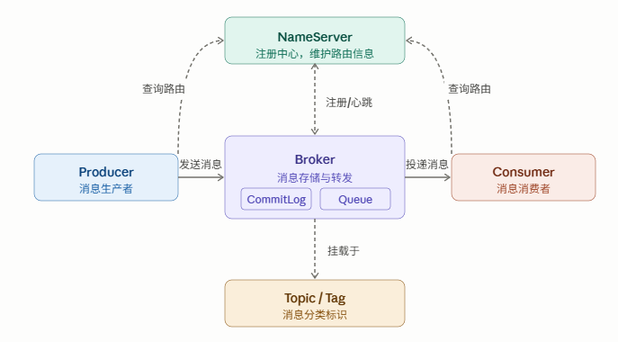

## RocketMQ是什么？为什么用它？

Rocket MQ是消息队列，消息队列主要解决两个核心问题：

解耦：把一个长业务链路拆开。比如"用户调薪 → 发邮件通知"，不需要调薪服务直接调邮件服务，只需发一条 MQ 消息，邮件服务自己消费。

**削峰**：秒杀、促销时请求量暴增，MQ 充当缓冲池，让后端按自己的节奏处理，不被流量打垮。

## RocketMQ的核心概念

| 概念 | 解释 |
| --- | --- |
| **NameServer** | 注册中心，无状态，多台部署互不通信。Broker 向它注册，Producer/Consumer 向它查路由 |
| **Broker** | 真正存储和转发消息的服务器，有 Master/Slave 架构 |
| **Producer** | 消息发送方，找到 NameServer 后直连 Broker 发消息 |
| **Consumer** | 消息消费方，从 Broker 拉取或接收推送的消息 |
| **Topic** | 消息的一级分类（如 `order-topic`），一个 Topic 对应多个队列 |
| **Tag** | 消息的二级过滤标签（如 `PAY_SUCCESS`），Consumer 可按 Tag 订阅 |
| 消费者组 | 同组内的 Consumer 共同消费同一 Topic，实现负载均衡 |




## 在DDD结构中的位置

```
domain 层（领域层）     →  定义领域事件对象 SalaryAdjustEvent
infrastructure 层（基础设施层）  →  EventPublisher 负责实际发送消息
trigger 层（触发器层）  →  MQListener 监听并消费消息
```

**为什么这样设计？** 因为 MQ 消息本质是"领域事件"——某件事发生了（如调薪完成），通过事件通知后续流程。把事件定义在 domain 层，发送交给 infrastructure 层，消费放在 trigger 层，职责清晰，不会出现"哪里都能发 MQ"的混乱局面。

## RocketMQ环境安装

**docker-compose.yml（核心片段）：**

```yaml
rocketmq:
  image: livinphp/rocketmq:5.1.3
  container_name: rocketmq
  ports:
    - 9009:9009   # 控制台 Web UI
    - 9876:9876   # NameServer
    - 10911:10911 # Broker 主端口
  volumes:
    - ./data:/home/app/data
  environment:
    TZ: "Asia/Shanghai"
    NAMESRV_ADDR: "rocketmq（服务器IP）:9876"
```

**⚠️ 首次启动后必做的两件事：**

1. 编辑 `data/rocketmq/conf/broker.conf`，末尾加一行：

   `brokerIP1 = 127.0.0.1（服务器IP）`

<aside>
💡

**！！！！！！**

**Linux部署的时候有个小坑，整个data文件大家记得chmod -R 777**

</aside>

1. 编辑 `data/console/config/application.properties`，改端口（避免与本地冲突）：

   `server.port=9009`

**创建 Topic 和消费者组（命令行方式）：**

```bash
# 创建 Topic
docker exec -it rocketmq sh /home/app/rocketmq/bin/mqadmin \
  updateTopic -n localhost:9876 -c DefaultCluster -t xfg-mq

# 创建消费者组
docker exec -it rocketmq sh /home/app/rocketmq/bin/mqadmin \
  updateSubGroup -n localhost:9876 -c DefaultCluster -g xfg-group
```

## SpringBoot集成

**引入依赖**

```xml
<dependency>
    <groupId>org.apache.rocketmq</groupId>
    <artifactId>rocketmq-spring-boot-starter</artifactId>
    <version>2.2.0</version>
</dependency>
```

**配置文件**

```yaml
rocketmq:
  name-server: 127.0.0.1（服务器IP）:9876
  producer:
    group: xfg-group               # 生产者组名，同类消息用同一组
    sendMessageTimeout: 10000      # 发送超时（毫秒）
    retryTimesWhenSendFailed: 2    # 同步发送失败重试次数
    retryTimesWhenSendAsyncFailed: 2 # 异步发送失败重试次数
  consumer:
    group: xfg-group               # 消费者组名
    pull-batch-size: 10            # 单次拉取最大消息数
```

**定义领域事件（domain 层）**

```java
// domain/salary/event/SalaryAdjustEvent.java
@Data
@EqualsAndHashCode(callSuper = true)
public class SalaryAdjustEvent extends BaseEvent<AdjustSalaryApplyOrderAggregate> {

    // Topic 常量定义在事件类本身，方便统一管理
    public static final String TOPIC = "xfg-mq";

    // 工厂方法：把聚合对象包装成事件
    public static SalaryAdjustEvent create(AdjustSalaryApplyOrderAggregate aggregate) {
        SalaryAdjustEvent event = new SalaryAdjustEvent();
        event.setId(RandomStringUtils.randomNumeric(11)); // 唯一消息ID
        event.setTimestamp(new Date());
        event.setData(aggregate);
        return event;
    }
}

// domain/event/BaseEvent.java（公共基类）
@Data
public abstract class BaseEvent<T> {
    private String id;        // 消息唯一ID
    private Date timestamp;   // 消息产生时间
    private T data;           // 业务数据载体
}
```

**消息发送（infrastructure 层）**

```java
// infrastructure/event/EventPublisher.java
@Component
@Slf4j
public class EventPublisher {

    @Autowired
    private RocketMQTemplate rocketmqTemplate;

    /**
     * 普通消息发送
     */
    public void publish(String topic, BaseEvent<?> message) {
        try {
            String mqMessage = JSON.toJSONString(message);
            log.info("发送MQ消息 topic:{} message:{}", topic, mqMessage);
            rocketmqTemplate.convertAndSend(topic, mqMessage);
        } catch (Exception e) {
            log.error("发送MQ消息失败 topic:{} message:{}", topic, JSON.toJSONString(message), e);
            // 生产环境：需要写入 task 表，由定时任务补偿重发
        }
    }

    /**
     * 延迟消息发送（如：30分钟未支付自动取消订单）
     * delayTimeLevel: 1=1s, 2=5s, 3=10s, 4=30s, 5=1m, ...18=2h
     */
    public void publishDelay(String topic, BaseEvent<?> message, int delayTimeLevel) {
        try {
            String mqMessage = JSON.toJSONString(message);
            log.info("发送延迟MQ消息 topic:{} message:{}", topic, mqMessage);
            rocketmqTemplate.syncSend(topic,
                MessageBuilder.withPayload(mqMessage).build(),
                3000,           // 发送超时
                delayTimeLevel  // 延迟级别
            );
        } catch (Exception e) {
            log.error("发送延迟MQ消息失败", e);
        }
    }
}
```

**在 Repository 中调用（infrastructure 仓储实现）：**

```java
// infrastructure/repository/SalaryAdjustRepository.java
@Resource
private EventPublisher eventPublisher;

@Override
@Transactional(rollbackFor = Exception.class)
public String adjustSalary(AdjustSalaryApplyOrderAggregate aggregate) {
    // 1. 业务逻辑：写数据库
    String orderId = doSaveToDB(aggregate);

    // 2. 发送 MQ 消息（注意：最好在事务提交后发送，不要把发送写在事务内）
    eventPublisher.publish(SalaryAdjustEvent.TOPIC, SalaryAdjustEvent.create(aggregate));

    return orderId;
}
```

**消息消费（trigger 层）**

```java
// trigger/mq/SalaryAdjustMQListener.java
@Component
@Slf4j
@RocketMQMessageListener(
    topic = "xfg-mq",          // 监听的 Topic
    consumerGroup = "xfg-group" // 消费者组
)
public class SalaryAdjustMQListener implements RocketMQListener<String> {

    @Override
    public void onMessage(String message) {
        log.info("接收到MQ消息 {}", message);
        // 反序列化
        SalaryAdjustEvent event = JSON.parseObject(message, SalaryAdjustEvent.class);

        // 业务处理（如：发邮件、更新统计数据等）
        try {
            handleMessage(event);
        } catch (Exception e) {
            log.error("消费消息异常", e);
            // 抛出异常会导致消息重新投递（RocketMQ 默认最多重试 16 次）
            throw e;
        }
    }

    private void handleMessage(SalaryAdjustEvent event) {
        // 实际业务逻辑
        log.info("处理调薪事件: orderId={}", event.getData().getOrderId());
    }
}
```

## 注意事项

**① 不要在数据库事务内发送 MQ**

事务会长时间占用数据库连接，MQ 发送如果耗时或失败会导致事务迟迟无法提交。正确做法是事务提交后再发。

**② 强一致性场景需要消息补偿**

发送 MQ 前先往数据库写一条 `task` 记录（状态=待发送），发送成功后更新为已完成。定时任务扫描长时间未完成的记录重发。

**③ 消费者要做幂等**

网络重试可能导致同一条消息被消费多次，消费逻辑必须保证重复执行结果一致（如：用 `orderId` 做去重）。

**④ 消费失败不要随便 catch 掉异常**

如果业务处理失败应抛出异常，RocketMQ 会重新投递消息（最多 16 次），超次后进入死信队列，便于后续排查。