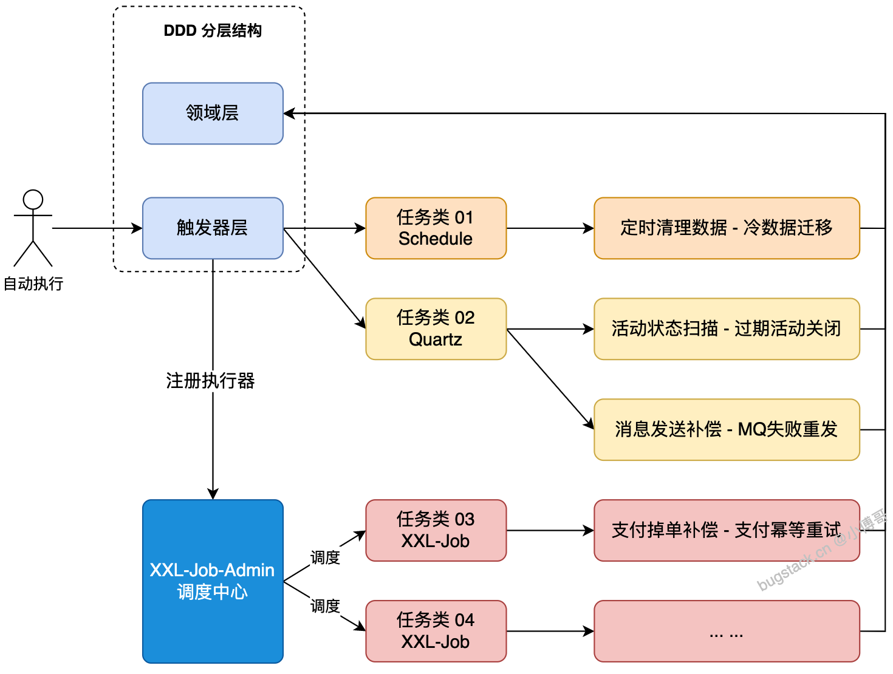

## 为什么需要任务调度？

任务调度用于在**特定时间或固定频率**下自动执行某段业务逻辑，无需人工触发。

**典型应用场景：**

| **场景** | **说明** |
| --- | --- |
| 冷数据迁移 | 定时清理过期数据，迁移到归档库 |
| 活动状态扫描 | 定期扫描并关闭已过期的活动 |
| MQ 消息补偿 | 扫描发送失败的消息，重新投递 |
| 支付掉单补偿 | 定时检查支付状态，幂等重试 |

## 三种实现对比

| **方案** | **适用场景** | **特点** |
| --- | --- | --- |
| **Spring @Scheduled** | 简单单机任务 | 零依赖，注解驱动，最轻量 |
| **Quartz** | 单机/稍复杂调度 | 功能强大，支持 cron，可持久化 |
| **XXL-Job** | 分布式、多执行器 | 有管理界面，支持集群，生产首选 |

> 🔑 **选型原则**：场景简单用 Spring Schedule；需要分布式管理用 XXL-Job。
> 

## 在DDD架构中的位置



```
trigger（触发器层）   ← 任务调度入口放在这里
    ↓
application（编排层） ← 如有防腐层则调用这里
    ↓
domain（领域层）      ← 具体业务逻辑
```

所有的调用行为（HTTP、RPC、MQ、**定时任务**）都视为"触发器"，统一放在 `trigger` 模块。

## 方案一：**Spring @Scheduled（最简单）**

### 启动调度

在启动类或配置类上加注解：

```java
@SpringBootApplication
@EnableScheduling  // 开启任务调度
public class Application {
    public static void main(String[] args) {
        SpringApplication.run(Application.class, args);
    }
}
```

### 编写任务

```java
@Slf4j
@Component
public class QuartzJob {

    // 每 3 秒执行一次
    @Scheduled(cron = "0/3 * * * * ?")
    public void execute01() {
        log.info("执行任务 - 01");
        // 调用领域层/应用层的业务方法
    }

    // 同一个类中可以定义多个任务
    @Scheduled(cron = "0/5 * * * * ?")
    public void execute02() {
        log.info("执行任务 - 02");
    }
}
```

cron表达式（这种东西可以让AI生成没必要）

```
格式：秒 分 时 日 月 周 [年]

常用示例：
  0/3 * * * * ?        每 3 秒执行一次
  0 0/5 * * * ?        每 5 分钟执行一次
  0 0 2 * * ?          每天凌晨 2 点执行
  0 0 10,14 * * ?      每天 10 点和 14 点执行
  0 0 0 1 * ?          每月 1 日 0 点执行
  0 0 8 ? * MON-FRI    工作日每天 8 点执行
```

## **方案二：Spring Schedule 扩展（自动注册任务）**

通过自定义注解 + `SchedulingConfigurer`，**动态扫描并注册任务**，适合同类任务需要统一管理的场景

### 自定义注解

```java
@Target(ElementType.TYPE)
@Retention(RetentionPolicy.RUNTIME)
public @interface ExtScheduleJobConfig {
    String jobName();           // 任务名称
    String cronExpression();    // cron 表达式
    boolean state() default true; // 是否启用
}
```

### 任务接口

```java
public interface ExtScheduleJob extends Runnable {
    // 继承 Runnable，run() 就是任务执行逻辑
}
```

### 任务注册器

```java
@Slf4j
@Configuration
@EnableScheduling
public class JobRegistrarAutoConfig implements SchedulingConfigurer {

    private final ApplicationContext applicationContext;

    public JobRegistrarAutoConfig(ApplicationContext applicationContext) {
        this.applicationContext = applicationContext;
    }

    @Override
    public void configureTasks(ScheduledTaskRegistrar taskRegistrar) {
        // 扫描所有实现了ExtScheduleJob 的 Bean
        Map<String, ExtScheduleJob> jobBeanMap = applicationContext.getBeansOfType(ExtScheduleJob.class);
        for (ExtScheduleJob job : jobBeanMap.values()) {
            ExtScheduleJobConfig config = AnnotationUtils.findAnnotation(job.getClass(), ExtScheduleJobConfig.class);
            if (config == null || !config.state()) continue; // state=false 则跳过

            log.info("启动任务 {} {}", config.jobName(), config.cronExpression());
            taskRegistrar.addCronTask(job, config.cronExpression()); // 动态注册
        }
    }
}
```

### 编写具体任务

```java
@Slf4j
@Component
@ExtScheduleJobConfig(jobName = "订单扫描任务", cronExpression = "0/3 * * * * ?", state = true)
public class ScheduleJob implements ExtScheduleJob {

    @Override
    public void run() {
        log.info("执行任务 - Schedule - 01");
        // 业务逻辑
    }
}
```

💡 **优点**：只需新增一个实现类 + 注解，无需修改任何配置，任务自动被发现并注册。

## **方案三：XXL-Job 分布式任务调度（生产推荐）**

### 架构理解


```
XXL-Job Admin（调度中心）
    ↓ 下发任务
执行器 1（你的 SpringBoot 服务）
执行器 2（你的 SpringBoot 服务）
    ↓ 调用
微服务接口（RPC/HTTP）
```

- **调度中心**：管理所有任务的配置、触发、监控
- **执行器**：你的业务服务，注册到调度中心，等待被调用
- 执行器宕机时，任务可迁移到其他执行器，具备**高可用**

### 安装xxl-job

创建 `xxl-job-docker-compose.yml`：

```yaml
version: '3.9'
services:
  xxl-job-admin:
    image: kuschzzp/xxl-job-aarch64:2.4.0  # 支持 AMD/ARM
    container_name: xxl-job-admin
    restart: always
    depends_on:
      - mysql
    ports:
      - "9090:9090"
    links:
      - mysql
    environment:
      - SPRING_DATASOURCE_URL=jdbc:mysql://mysql:3306/xxl_job?serverTimezone=Asia/Shanghai&characterEncoding=utf8
      - SPRING_DATASOURCE_USERNAME=root
      - SPRING_DATASOURCE_PASSWORD=123456
      - SERVER_PORT=9090

  mysql:
    image: mysql:8.0.32
    container_name: mysql
    command: --default-authentication-plugin=mysql_native_password
    restart: always
    environment:
      TZ: Asia/Shanghai
      MYSQL_ROOT_PASSWORD: 123456
    ports:
      - "13306:3306"
    volumes:
      - ./sql:/docker-entrypoint-initdb.d  # 自动初始化 xxl_job 库表
    volumes_from:
      - mysql-job-dbdata

  mysql-job-dbdata:
    image: alpine:3.18.2
    container_name: mysql-job-dbdata
    volumes:
      - /var/lib/mysql
```

启动命令：

```
docker-compose -f xxl-job-docker-compose.yml up -d
```

访问地址：`http://127.0.0.1:9090/xxl-job-admin`  
默认账号：`admin` / `123456`

### 引入pom依赖

```xml
<!-- XXL-Job -->
<dependency>
    <groupId>com.xuxueli</groupId>
    <artifactId>xxl-job-core</artifactId>
    <version>2.4.0</version>
</dependency>

<!-- Quartz（可选，Spring Boot 已集成） -->
<dependency>
    <groupId>org.springframework.boot</groupId>
    <artifactId>spring-boot-starter-quartz</artifactId>
    <version>3.1.2</version>
</dependency>
```

### 配置application.yml

```yaml
xxl:
  job:
    accessToken: default_token   # 注意：官方有 bug，建议保留此配置
    admin:
      addresses: http://localhost（服务器IP）:9090/xxl-job-admin  # 调度中心地址
    executor:
      appname: xxl-job-executor-sample  # 执行器名称，要与调度中心配置一致
      address:         # 为空则自动获取 IP
      ip:              # 为空则自动获取
      port: 9999       # 执行器端口
      logpath: ./data/applogs/xxl-job/jobhandler
      logretentiondays: 30
```

### 注册执行器配置

```java
@Configuration
public class XxlJobConfig {

    @Value("${xxl.job.admin.addresses}")
    private String adminAddresses;

    @Value("${xxl.job.accessToken}")
    private String accessToken;

    @Value("${xxl.job.executor.appname}")
    private String appname;

    @Value("${xxl.job.executor.ip}")
    private String ip;

    @Value("${xxl.job.executor.port}")
    private int port;

    @Value("${xxl.job.executor.logpath}")
    private String logPath;

    @Value("${xxl.job.executor.logretentiondays}")
    private int logRetentionDays;

    @Bean
    public XxlJobSpringExecutor xxlJobExecutor() {
        XxlJobSpringExecutor executor = new XxlJobSpringExecutor();
        executor.setAdminAddresses(adminAddresses);
        executor.setAccessToken(accessToken);
        executor.setAppname(appname);
        executor.setIp(ip);
        executor.setPort(port);
        executor.setLogPath(logPath);
        executor.setLogRetentionDays(logRetentionDays);
        return executor;
    }
}
```

### 编写任务Handler

```java
@Slf4j
@Component
public class XXLJob {

    // 注解的值对应调度中心配置的 JobHandler 名称
    @XxlJob("demoJobHandler")
    public void doJob() {
        log.info("执行任务 - XXL-Job - 01");
        // 业务逻辑，如：扫描超时未支付订单
    }

    @XxlJob("orderScanHandler")
    public void scanOrder() {
        log.info("扫描超时订单");
        // 调用 domain 层或 application 层
    }
}
```

### 在调度中心配置任务

在 `http://127.0.0.1:9090/xxl-job-admin/jobinfo` 新增任务：

| **字段** | **值** |
| --- | --- |
| 执行器 | xxl-job-executor-sample |
| 任务描述 | 我的定时任务 |
| Cron | `0/3 * * * * ?` |
| 运行模式 | BEAN |
| JobHandler | `demoJobHandler`（与注解名一致） |


### **注意事项**

- 本地开发时如 XXL-Job 部署在云端，执行器需要公网 IP（可用 natapp 内网穿透测试）
- `accessToken` 建议配置为 `default_token`，避免官方已知 bug
- 任务逻辑尽量保持**幂等性**，防止重复执行造成数据异常
- 任务只是"入口"，业务逻辑应下沉到 domain 或 application 层

[Quartz & XXL-Job](https://bugstack.cn/md/road-map/quartz.html)