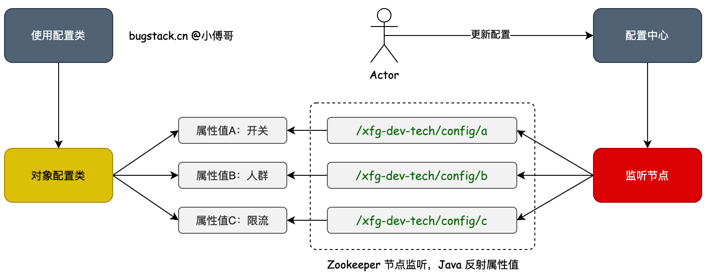

## ZooKeeper 是什么？

ZooKeeper 是 Apache 开源的**分布式协调服务**，本质是一个**高可用的分布式树形数据库**。它不是用来存大量业务数据的，而是专门用来协调分布式系统中各节点的行为。

### 核心能力

| **能力** | **说明** |
| --- | --- |
| **节点存储** | 像文件系统一样，以路径形式存储少量数据（默认上限 1MB） |
| **节点监听（Watch）** | 客户端可以监听某个节点，节点数据或子节点变化时，服务器主动推送通知 |
| **临时节点** | 客户端断开连接后，临时节点自动删除——常用于心跳/锁/服务注册 |
| **顺序节点** | 创建时自动加上递增后缀，常用于分布式锁排队 |

### 典型应用场景

- **配置中心**：动态下发配置（本文重点）
- **服务注册与发现**：Dubbo 等 RPC 框架的注册中心
- **分布式锁**：基于临时顺序节点实现公平锁
- **Leader 选举**：多节点中选出主节点

### 数据结构：ZNode树

ZooKeeper 的数据模型是一棵树，每个节点叫 **ZNode**，类似 Linux 的文件路径：

```
/
├── xfg-dev-tech
│   └── config
│       ├── downgradeSwitch   （值: "开"）
│       └── userWhiteList     （值: "xfg,user1,user2"）
```



> 📌 **图示参考**：展示了配置中心的整体架构——ZooKeeper 节点路径与 Java 类属性的映射关系。
> 

## ZNode 节点类型详解

| **类型** | **创建命令** | **特点** |
| --- | --- | --- |
| **持久节点**（PERSISTENT） | `create /path data` | 默认类型，客户端断开后依然存在 |
| **临时节点**（EPHEMERAL） | `create -e /path data` | 客户端会话结束自动删除 |
| **持久顺序节点**（PERSISTENT_SEQUENTIAL） | `create -s /path data` | 节点名自动追加 10 位数字后缀 |
| **临时顺序节点**（EPHEMERAL_SEQUENTIAL） | `create -e -s /path data` | 临时 + 自动编号，分布式锁常用 |

## Docker 安装 ZooKeeper

### docker-compose.yml 示例

```yaml
version:'3'
services:
  zookeeper:
    image:zookeeper:3.9.0
    container_name:zookeeper
    ports:
      -"2181:2181"
    environment:
      ZOO_MY_ID:1
      ZOO_SERVERS:server.1=0.0.0.0:2888:3888;2181
    restart:always
```

```
# 启动
docker-compose -f docker-compose.yml up -d
```

## ZooKeeper CLI 常用命令

### 进入容器并连接

```
docker exec -it zookeeper bash
zkCli.sh -server 你的IP:2181
```

### 常用操作命令

```
# 查看子节点
ls /path

# 创建节点（持久）
create /path "数据"

# 创建临时节点
create -e /path "数据"

# 创建顺序节点
create -s /path "数据"

# 创建临时顺序节点
create -e -s /path "数据"

# 获取节点数据
get /path

# 修改节点数据
set /path "新数据"

# 删除节点（无子节点时）
delete /path

# 递归删除节点及所有子节点
deleteall /path

# 监听节点数据变化（一次性 watch）
get -w /path

# 查看节点状态（版本、时间戳等元信息）
stat /path
```

---

## Curator

ZooKeeper 原生客户端 API 较繁琐，实际项目中一般使用 Apache **Curator** 框架，它对原生 API 做了大量封装，提供了更流畅的链式调用。

### Maven 依赖

```xml
<dependency>
    <groupId>org.apache.curator</groupId>
    <artifactId>curator-framework</artifactId>
    <version>5.5.0</version>
</dependency>
<dependency>
    <groupId>org.apache.curator</groupId>
    <artifactId>curator-recipes</artifactId>
    <version>5.5.0</version>
</dependency>
```

---

## SpringBoot 整合 ZooKeeper

### 配置属性类

```java
@Data
@ConfigurationProperties(prefix = "zookeeper.sdk.config", ignoreInvalidFields = true)
public class ZookeeperClientConfigProperties {
    private String connectString;       // 连接地址，如 "127.0.0.1:2181"
    private int baseSleepTimeMs;        // 重试基础等待时间（毫秒）
    private int maxRetries;             // 最大重试次数
    private int sessionTimeoutMs;       // 会话超时时间
    private int connectionTimeoutMs;    // 连接超时时间
}
```

### application.yml 配置

```java
zookeeper:
  sdk:
    config:
      connect-string:127.0.0.1:2181
      base-sleep-time-ms:1000
      max-retries:3
      session-timeout-ms:1800000
      connection-timeout-ms:30000
```

### 注册 Curator 客户端 Bean

```java
@Configuration
@EnableConfigurationProperties(ZookeeperClientConfigProperties.class)
public class ZooKeeperClientConfig {

    @Bean(name = "zookeeperClient")
    public CuratorFramework createWithOptions(ZookeeperClientConfigProperties props) {
        // 指数退避重试策略：第一次等 baseSleepTimeMs，之后指数增加
        ExponentialBackoffRetry retryPolicy =
            new ExponentialBackoffRetry(props.getBaseSleepTimeMs(), props.getMaxRetries());

        CuratorFramework client = CuratorFrameworkFactory.builder()
                .connectString(props.getConnectString())
                .retryPolicy(retryPolicy)
                .sessionTimeoutMs(props.getSessionTimeoutMs())
                .connectionTimeoutMs(props.getConnectionTimeoutMs())
                .build();

        client.start(); // 启动客户端
        return client;
    }
}
```

---

## 实战：基于 ZooKeeper 实现配置中心


### 核心思路

```
ZooKeeper 节点路径  ←→  Java 类属性
/xfg-dev-tech/config/downgradeSwitch  ←→  ConfigController.downgradeSwitch
/xfg-dev-tech/config/userWhiteList    ←→  ConfigController.userWhiteList
```

**流程**：

1. 用自定义注解 `@DCCValue` 标记需要动态配置的字段
2. Spring 容器初始化时，扫描所有带该注解的字段，在 ZooKeeper 上创建对应节点
3. 对这些节点注册监听器（CuratorCache）
4. 节点数据变化时，通过 Java 反射将新值写入对应字段

### 自定义注解 `@DCCValue`

```java
@Retention(RetentionPolicy.RUNTIME)   // 运行时可读
@Target({ElementType.FIELD})          // 只能标注在字段上
@Documented
public @interface DCCValue {
    String value() default "";        // ZooKeeper 节点名（路径最后一段）
}
```

**使用示例**：

```java
@DCCValue("downgradeSwitch")
private String downgradeSwitch;

@DCCValue("userWhiteList")
private String userWhiteList;
```

### DCCValueBeanFactory：核心处理类

这个类实现了 Spring 的 `BeanPostProcessor` 接口，可以在每个 Bean 初始化完成后介入处理。

```java
@Slf4j
@Component
public class DCCValueBeanFactory implements BeanPostProcessor {

    private static final String BASE_CONFIG_PATH = "/xfg-dev-tech/config";

    // 存储：ZooKeeper路径 → 对应的 Bean 对象
    private final Map<String, Object> dccObjGroup = new HashMap<>();

    private final CuratorFramework client;
		// 动态配置实现
    public DCCValueBeanFactory(CuratorFramework client) throws Exception {
        this.client = client;

        // 启动 CuratorCache，监听整个 BASE_CONFIG_PATH 下所有节点的变化
        CuratorCache curatorCache = CuratorCache.build(client, BASE_CONFIG_PATH);
        curatorCache.start();

        curatorCache.listenable().addListener((type, oldData, data) -> {
            if (type == CuratorCacheListener.Type.NODE_CHANGED) {
                String changedPath = data.getPath();
                Object bean = dccObjGroup.get(changedPath);
                if (bean == null) return;

                // 从路径中取出字段名（路径最后一段）
                String fieldName = changedPath.substring(changedPath.lastIndexOf("/") + 1);

                try {
                    Field field = bean.getClass().getDeclaredField(fieldName);
                    field.setAccessible(true);                           // 允许访问私有字段
                    field.set(bean, new String(data.getData()));         // 反射赋值
                    field.setAccessible(false);
                    log.info("DCC 配置更新: {} = {}", changedPath, new String(data.getData()));
                } catch (Exception e) {
                    throw new RuntimeException(e);
                }
            }
        });
    }

    /**
     * 每个 Bean 初始化完成后执行
     * 扫描字段上的 @DCCValue，在 ZooKeeper 创建对应节点并注册到 Map
     */
    @Override
    public Object postProcessAfterInitialization(Object bean, String beanName) throws BeansException {
        for (Field field : bean.getClass().getDeclaredFields()) {
            if (!field.isAnnotationPresent(DCCValue.class)) continue;

            DCCValue dccValue = field.getAnnotation(DCCValue.class);
            String nodePath = BASE_CONFIG_PATH + "/" + dccValue.value();

            try {
                // 节点不存在则自动创建（含父路径）
                if (client.checkExists().forPath(nodePath) == null) {
                    client.create().creatingParentsIfNeeded().forPath(nodePath);
                    log.info("DCC 节点不存在，已创建: {}", nodePath);
                }
            } catch (Exception e) {
                throw new RuntimeException(e);
            }

            // 记录路径 → Bean 的映射，供监听器使用
            dccObjGroup.put(nodePath, bean);
        }
        return bean;
    }
}
```

> 💡 **关键点解析**
> 
> - `getDeclaredField` vs `getField`：前者可以获取**私有字段**，后者只能获取 `public` 字段。配置类字段通常是 `private`，所以必须用 `getDeclaredField` + `setAccessible(true)`。
> - `CuratorCache` 是 Curator 5.x 推荐的监听方式，它会**持续监听**（不像 ZooKeeper 原生 Watch 只触发一次）。

### Controller 中使用

```java
@RestController
public class ConfigController {

    @DCCValue("downgradeSwitch")
    private String downgradeSwitch;

    @DCCValue("userWhiteList")
    private String userWhiteList;

    @Resource
    private CuratorFramework curatorFramework;

    // 读取配置值
    @GetMapping("/getConfig/downgradeSwitch")
    public String getDowngradeSwitch() {
        return downgradeSwitch;
    }

    @GetMapping("/getConfig/userWhiteList")
    public String getUserWhiteList() {
        return userWhiteList;
    }

    // 修改配置值（实际项目中应由管理后台调用）
    @GetMapping("/setConfig")
    public void setConfig(Boolean downgradeSwitch, String userWhiteList) throws Exception {
        curatorFramework.setData().forPath(
            "/xfg-dev-tech/config/downgradeSwitch",
            (downgradeSwitch ? "开" : "关").getBytes(StandardCharsets.UTF_8)
        );
        curatorFramework.setData().forPath(
            "/xfg-dev-tech/config/userWhiteList",
            userWhiteList.getBytes(StandardCharsets.UTF_8)
        );
    }
}
```

**验证步骤**：

```
# 1. 先读取当前值（应为空或初始值）
curl http://localhost:8091/getConfig/downgradeSwitch

# 2. 修改配置
curl "http://localhost:8091/setConfig?downgradeSwitch=false&userWhiteList=xfg,user2,user3"

# 3. 再次读取，值应已变化（无需重启服务）
curl http://localhost:8091/getConfig/downgradeSwitch
```


---

## Curator 常用操作代码速查

```java
// ---- 节点创建 ----

// 创建持久节点（含父路径）
client.create().creatingParentsIfNeeded().forPath("/a/b/c", "data".getBytes());

// 创建临时节点
client.create().withMode(CreateMode.EPHEMERAL).forPath("/lock", "data".getBytes());

// 创建临时顺序节点（用于分布式锁）
client.create()
      .withMode(CreateMode.EPHEMERAL_SEQUENTIAL)
      .forPath("/lock/node-", "data".getBytes());
// 实际路径会变成 /lock/node-0000000001

// ---- 数据读写 ----

// 读取节点数据
byte[] bytes = client.getData().forPath("/path");
String value = new String(bytes, StandardCharsets.UTF_8);

// 修改节点数据
client.setData().forPath("/path", "newValue".getBytes());

// 异步修改（带回调）
CuratorListener listener = (c, event) -> {
    log.info("异步操作完成: type={}, stat={}", event.getType(), event.getStat());
};
client.getCuratorListenable().addListener(listener);
client.setData().inBackground().forPath("/path", "newValue".getBytes());

// ---- 节点删除 ----

// 删除节点（含所有子节点）
client.delete().deletingChildrenIfNeeded().forPath("/path");

// 安全删除（guaranteed：即使网络抖动也确保最终删除）
client.delete().guaranteed().forPath("/path");

// ---- 查询 ----

// 判断节点是否存在
Stat stat = client.checkExists().forPath("/path");
boolean exists = (stat != null);

// 获取所有子节点名
List<String> children = client.getChildren().forPath("/path");

// 获取子节点并注册一次性 Watch（有变化时触发）
List<String> children = client.getChildren().watched().forPath("/path");
```

---

## 节点监听方式对比

| **方式** | **特点** | **适用场景** |
| --- | --- | --- |
| `get -w /path`（CLI） | 一次性 watch，触发后需重新注册 | 调试验证 |
| `NodeCache`（旧 API） | 监听单个节点 | Curator 3.x |
| `PathChildrenCache`（旧 API） | 监听子节点 | Curator 3.x |
| **`CuratorCache`（推荐）** | 监听整棵子树，持续有效，Curator 5.x 推荐 | 生产项目 |

---

## 架构补充：ZooKeeper 集群

实际生产中 ZooKeeper 以奇数节点（通常 3 或 5 个）组成集群，使用 **ZAB（ZooKeeper Atomic Broadcast）协议** 保证一致性：

```
          ┌──────────────┐
客户端 ───▶│  Leader 节点  │◀─── 所有写请求必须经过 Leader
          └──────┬───────┘
                 │ 广播
        ┌────────┴────────┐
   ┌────▼────┐      ┌────▼────┐
   │Follower │      │Follower │  ◀─── 读请求可分散到 Follower
   └─────────┘      └─────────┘
```

- 写请求：全部路由到 **Leader**，Leader 广播给 Follower，超过半数确认后才返回成功
- 读请求：可以直接读任意节点（包括 Follower），**可能读到稍旧的数据**
- 容错：3 个节点允许 1 个宕机，5 个节点允许 2 个宕机