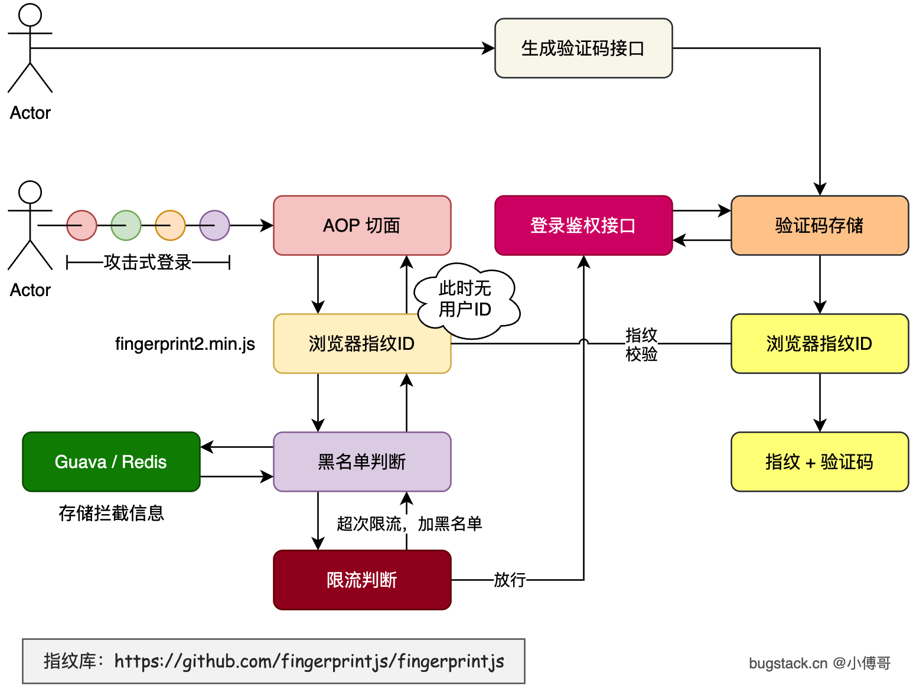

## 为什么需要限流

### 问题背景

以"登录接口"为例，存在以下安全威胁：

- **暴力撞库**：攻击者用大量手机号 + 验证码穷举，频繁调用登录接口
- **验证码窃取**：录屏诈骗等手段拿到用户验证码后反复登录尝试
- **服务器压力**：恶意高频访问导致服务不可用

> 💡 **理解：** 限流就像超市收银台前的"每人限购 X 件"——不管你是真顾客还是黄牛，规则对所有人公平执行，保护系统正常运转。

### 解决思路

| **防护手段** | **说明** |
| --- | --- |
| 图片验证码 / 滑块 | 阻止机器自动化操作 |
| 浏览器指纹绑定验证码 | 验证码只对特定设备有效，偷到也没用 |
| **接口限流** | 对每个用户/设备限制单位时间内的访问次数 ✅ |
| **自动黑名单** | 超出限流阈值 N 次后，直接封禁 24 小时 ✅ |

> 本文重点是后两者：**限流 + 自动黑名单**

## 核心概念

### 什么是限流（Rate Limiting）？

限流是控制某个资源被访问频率的机制。常见的限流算法：

| **算法** | **原理** | **特点** |
| --- | --- | --- |
| **令牌桶**（Token Bucket） | 以固定速率往桶里放令牌，请求消耗令牌 | 允许突发流量，Guava RateLimiter 用的这个 |
| 漏桶（Leaky Bucket） | 请求进入队列，以固定速率处理 | 严格平滑，不允许突发 |
| 固定窗口计数 | 单位时间内计数，超过阈值拒绝 | 简单，有临界问题 |
| 滑动窗口 | 更精确的时间窗口计数 | 较精准，实现复杂 |

> Guava `RateLimiter` 使用**令牌桶算法**，`permitsPerSecond=1.0` 表示每秒生成 1 个令牌，即每秒最多处理 1 次请求。

### 什么是浏览器指纹（Browser Fingerprint）？

浏览器指纹是通过收集浏览器特征（屏幕分辨率、插件列表、字体、Canvas 渲染等）生成的唯一标识符，可以在不使用 Cookie 的情况下识别同一用户/设备。

```tsx
// 前端引入 FingerprintJS 生成设备唯一 ID
const fpPromise = import('https://openfpcdn.io/fingerprintjs/v4')
  .then(FingerprintJS => FingerprintJS.load())

fpPromise
  .then(fp => fp.get())
  .then(result => {
    const visitorId = result.visitorId  // 形如 "uljpplllll01009"
    console.log(visitorId)
    // 将 visitorId 作为参数传给后端接口
  })
```

> 💡 以 `visitorId` 作为限流的 key，就能做到**对单个用户/设备维度的限流**，而不是全局限流。

### 什么是服务治理？

服务治理是对应用可用性和稳定性的一系列手段，包括：

- **熔断**（Circuit Breaker）：下游服务不可用时快速失败
- **降级**（Fallback）：返回兜底数据而不报错
- **限流**（Rate Limit）：控制访问频率 ← 本文主角
- **黑白名单**：直接放行或拒绝特定用户
- **切量**：灰度发布，控制流量比例

## 技术栈准备

### Guava RateLimiter

Google Guava 库中的限流工具，基于**令牌桶算法**。

```xml
<!-- Maven 依赖 -->
<dependency>
    <groupId>com.google.guava</groupId>
    <artifactId>guava</artifactId>
    <version>32.1.2-jre</version>
</dependency>
```

核心 API：

```java
// 创建限流器：每秒允许 1.0 次请求
RateLimiter rateLimiter = RateLimiter.create(1.0);

// tryAcquire()：非阻塞获取令牌
// 有令牌返回 true，没有立即返回 false（不等待）
boolean acquired = rateLimiter.tryAcquire();

// acquire()：阻塞等待直到获取到令牌（不适合限流场景，会让请求排队等）
rateLimiter.acquire();
```

> ⚠️ 限流场景应用 `tryAcquire()`，获取不到就直接拒绝，而不是等待。

### Guava Cache

轻量级本地缓存，用于存储每个用户的限流器和黑名单记录。

```java
// 创建一个 1 分钟后过期的缓存
Cache<String, RateLimiter> loginRecord = CacheBuilder.newBuilder()
    .expireAfterWrite(1, TimeUnit.MINUTES)
    .build();

// 存取
loginRecord.put("userId_123", rateLimiter);
RateLimiter r = loginRecord.getIfPresent("userId_123"); // 不存在返回 null
```

> 💡 **为什么用 Guava Cache 而不是 HashMap？**
Guava Cache 支持**自动过期**，限流记录 1 分钟过期（即 1 分钟内没访问的用户，其限流器会被清理），避免内存泄漏。
> 

### Spring AOP

面向切面编程，让限流逻辑与业务代码解耦。不用在每个接口方法里手写限流代码，只需在方法上加注解。

## 整体架构设计

```
HTTP 请求
    ↓
[AOP 切面拦截] ← @AccessInterceptor 注解触发
    ↓
① 提取 key（如 fingerprint 参数值）
    ↓
② 黑名单检查 → 命中？→ 直接调用 fallbackMethod 返回
    ↓（未命中黑名单）
③ 获取/创建该用户的 RateLimiter
    ↓
④ tryAcquire() 尝试获取令牌
    ├── 成功 → jp.proceed() 执行原方法
    └── 失败 → 黑名单计数 +1 → 调用 fallbackMethod 返回
```



## 代码实现详解

### 自定义注解 `@AccessInterceptor`

```java
@Documented
@Retention(RetentionPolicy.RUNTIME)   // 运行时保留，AOP 才能读取
@Target({ElementType.TYPE, ElementType.METHOD})  // 可用在类或方法上
public @interface AccessInterceptor {

    /** 用哪个参数字段作为限流 key，默认 "all" 表示不区分用户 */
    String key() default "all";

    /** 令牌桶速率：每秒允许的请求次数 */
    double permitsPerSecond();

    /** 进入黑名单的阈值：被限流多少次后加入黑名单，0 表示不启用黑名单 */
    double blacklistCount() default 0;

    /** 被拦截后调用的降级方法名（方法签名必须与原方法一致） */
    String fallbackMethod();
}
```

**注解各字段说明：**

| **属性** | **类型** | **含义** | **示例** |
| --- | --- | --- | --- |
| `key` | String | 从方法参数中取哪个字段作为限流维度 | `"fingerprint"` |
| `permitsPerSecond` | double | 每秒允许的请求次数（令牌桶速率） | `1.0d` |
| `blacklistCount` | double | 超过几次限流后进黑名单，0=不启用 | `10` |
| `fallbackMethod` | String | 被拦截时调用的兜底方法名 | `"loginErr"` |

### 切面核心逻辑

```java
@Slf4j
@Aspect
@Component
public class RateLimiterAOP {

    // 每个用户的 RateLimiter，1分钟内无访问则自动清除
    private final Cache<String, RateLimiter> loginRecord = CacheBuilder.newBuilder()
            .expireAfterWrite(1, TimeUnit.MINUTES)
            .build();

    // 黑名单记录，24小时后自动解除
    // 生产环境建议改用 Redis，支持分布式场景
    private final Cache<String, Long> blacklist = CacheBuilder.newBuilder()
            .expireAfterWrite(24, TimeUnit.HOURS)
            .build();

    // 切点：拦截所有标注了 @AccessInterceptor 的方法
    @Pointcut("@annotation(cn.bugstack.xfg.dev.tech.annotation.AccessInterceptor)")
    public void aopPoint() {}

    @Around("aopPoint() && @annotation(accessInterceptor)")
    public Object doRouter(ProceedingJoinPoint jp, AccessInterceptor accessInterceptor) throws Throwable {
        String key = accessInterceptor.key();
        if (StringUtils.isBlank(key)) {
            throw new RuntimeException("annotation RateLimiter key is null!");
        }

        // Step1: 从方法参数中提取 key 对应的值（如取 fingerprint 参数的值）
        String keyAttr = getAttrValue(key, jp.getArgs());
        log.info("aop attr {}", keyAttr);

        // Step2: 黑名单检查
        // 条件：不是 "all" 模式 + 启用了黑名单 + 该用户在黑名单中 + 次数超阈值
        if (!"all".equals(keyAttr)
                && accessInterceptor.blacklistCount() != 0
                && null != blacklist.getIfPresent(keyAttr)
                && blacklist.getIfPresent(keyAttr) > accessInterceptor.blacklistCount()) {
            log.info("限流-黑名单拦截(24h)：{}", keyAttr);
            return fallbackMethodResult(jp, accessInterceptor.fallbackMethod());
        }

        // Step3: 获取该用户的 RateLimiter（不存在则创建）
        RateLimiter rateLimiter = loginRecord.getIfPresent(keyAttr);
        if (null == rateLimiter) {
            rateLimiter = RateLimiter.create(accessInterceptor.permitsPerSecond());
            loginRecord.put(keyAttr, rateLimiter);
        }

        // Step4: 尝试获取令牌（非阻塞）
        if (!rateLimiter.tryAcquire()) {
            // 获取失败：限流！更新黑名单计数
            if (accessInterceptor.blacklistCount() != 0) {
                Long count = blacklist.getIfPresent(keyAttr);
                blacklist.put(keyAttr, count == null ? 1L : count + 1L);
            }
            log.info("限流-超频次拦截：{}", keyAttr);
            return fallbackMethodResult(jp, accessInterceptor.fallbackMethod());
        }

        // Step5: 正常通过，执行原方法
        return jp.proceed();
    }

    /**
     * 通过反射调用降级方法
     * 要求降级方法与原方法参数类型完全一致，只是方法名不同
     */
    private Object fallbackMethodResult(JoinPoint jp, String fallbackMethod)
            throws NoSuchMethodException, InvocationTargetException, IllegalAccessException {
        Signature sig = jp.getSignature();
        MethodSignature methodSignature = (MethodSignature) sig;
        // 根据参数类型找到降级方法
        Method method = jp.getTarget().getClass()
                .getMethod(fallbackMethod, methodSignature.getParameterTypes());
        // 反射调用降级方法，传入原始参数
        return method.invoke(jp.getThis(), jp.getArgs());
    }

    /**
     * 从方法参数中获取指定字段的值
     * 如 key="fingerprint"，则从参数对象中找 fingerprint 字段的值
     */
    private String getAttrValue(String attr, Object[] args) {
        if ("all".equals(attr)) return "all";
        // 遍历参数，通过反射取出对应字段值
        for (Object arg : args) {
            if (arg == null) continue;
            try {
                // 基本类型/String 直接通过参数名匹配（需结合参数名称反射）
                // 简化版：如果 arg 本身就是 String，且参数名匹配
                Field field = arg.getClass().getDeclaredField(attr);
                field.setAccessible(true);
                return field.get(arg).toString();
            } catch (Exception ignored) {
                // 也可能参数直接就是 String 类型
                if (arg instanceof String) return (String) arg;
            }
        }
        return attr;
    }
}
```

### 接口使用示例

```java
@RestController
@RequestMapping("/api/ratelimiter")
public class RateLimiterController {

    /**
     * 登录接口：以 fingerprint（浏览器指纹）为维度进行限流
     * - 每秒最多 1 次
     * - 被限流超过 10 次后，该 fingerprint 进入 24h 黑名单
     */
    @AccessInterceptor(
        key = "fingerprint",         // 从参数中取 fingerprint 字段
        fallbackMethod = "loginErr", // 被拦截时调用 loginErr 方法
        permitsPerSecond = 1.0d,     // 每秒 1 次
        blacklistCount = 10          // 累计被限 10 次后进黑名单
    )
    @RequestMapping(value = "login", method = RequestMethod.GET)
    public String login(String fingerprint, String uId, String token) {
        log.info("模拟登录 fingerprint:{}", fingerprint);
        return "登录成功：" + uId;
    }

    /**
     * 降级方法：签名必须与 login 完全一致（参数类型和顺序），只是方法名不同
     */
    public String loginErr(String fingerprint, String uId, String token) {
        return "频次限制，请勿恶意访问！";
    }
}
```

> ⚠️ **注意事项：**
> 
> 1. `fallbackMethod` 的方法签名（参数类型、顺序）必须与原方法**完全一致**，否则反射找不到方法会报错
> 2. 降级方法不需要加 `@AccessInterceptor`，否则会死循环

---

## 完整执行流程图

```
用户请求 GET /api/ratelimiter/login?fingerprint=xxx&uId=1000
         │
         ▼
   AOP 切面拦截
         │
         ▼
  取 key="fingerprint" 对应的参数值 → "xxx"
         │
         ▼
  ┌──────────────────────────────────────┐
  │  blacklist.getIfPresent("xxx") > 10? │
  └──────────────────────────────────────┘
         │ YES                  │ NO
         ▼                      ▼
    调用 loginErr()    loginRecord.getIfPresent("xxx")
    返回错误信息             │ null？
                             │ YES: 创建新 RateLimiter(1.0)
                             │ NO: 复用已有 RateLimiter
                             ▼
                    rateLimiter.tryAcquire()
                    /                    \
                  true                  false
                   │                      │
                   ▼                      ▼
            jp.proceed()        blacklist 计数 +1
            执行原方法            调用 loginErr()
            返回正常结果          返回错误信息
```

---

## 生产环境注意事项

### 本地缓存 vs Redis

| **方面** | **Guava Cache（本地）** | **Redis（分布式）** |
| --- | --- | --- |
| 适用场景 | 单机部署 | 多节点/集群部署 |
| 数据共享 | ❌ 各节点独立 | ✅ 全节点共享 |
| 实现复杂度 | 简单 | 需引入 Redis |
| 性能 | 极快（内存） | 快（网络 I/O） |

> 💡 **结论：** 生产环境多实例部署时，应将 `blacklist` 和 `loginRecord` 改用 Redis 实现，否则 A 节点的黑名单 B 节点不知道。
> 

### key 的选择策略

| **key 来源** | **适用场景** |
| --- | --- |
| `fingerprint`（浏览器指纹） | 未登录用户的限流 |
| `userId` | 已登录用户的限流 |
| `IP` | 无登录无指纹时的兜底 |
| 组合（IP + UserAgent） | 更精准的设备识别 |

### 限流参数调优建议

```java
// 示例：登录接口，每 5 秒 1 次，超过 3 次进黑名单 1 小时
@AccessInterceptor(
    key = "fingerprint",
    permitsPerSecond = 0.2d,   // 每秒 0.2 次 = 每 5 秒 1 次
    blacklistCount = 3,
    fallbackMethod = "loginErr"
)
```

- **宽松**：`permitsPerSecond = 5`，每秒 5 次，适合查询接口
- **严格**：`permitsPerSecond = 0.1`，每 10 秒 1 次，适合验证码发送
- **黑名单**：`blacklistCount` 不宜过小，防止正常用户误封

---

## 小结

| **技术点** | **作用** |
| --- | --- |
| `Guava RateLimiter` | 令牌桶限流，控制每秒请求次数 |
| `Guava Cache` | 存储用户限流器和黑名单，自动过期 |
| `Spring AOP + 自定义注解` | 无侵入式地为接口添加限流能力 |
| `fallbackMethod 反射调用` | 被拦截时优雅降级，返回友好提示 |
| `浏览器指纹` | 前端获取设备唯一 ID，作为限流维度 |
