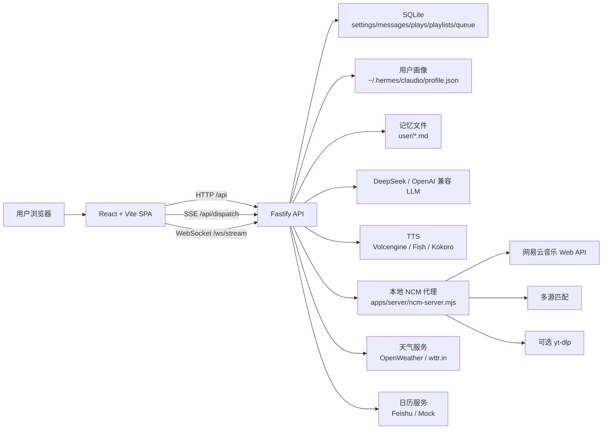
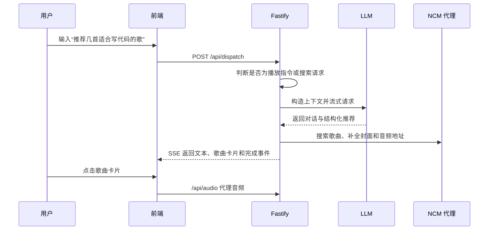

# Claudio AI Radio

面向个人音乐场景的 AI 电台与对话点歌应用：用自然语言描述心情、场景或歌手，Claudio 会生成推荐、串词和可播放队列，并提供完整的播放器、歌单、历史记录和用户画像体验。

## 项目介绍

Claudio AI Radio 是一个本地可运行的全栈音乐应用，核心体验分为两条线：

- **AI 点歌**：用户通过对话描述想听的音乐，系统识别播放控制、搜索请求或 AI 推荐请求；AI 回复通过 SSE 流式返回，并将推荐歌曲渲染为可点击的歌曲卡片。
- **AI 电台**：用户一键开启电台，后端结合时间、天气、日程、历史播放和用户画像生成播放计划；前端以 AI DJ 内容流、迷你播放器和逐步出现的时间线展示电台过程。

项目采用 `pnpm workspace` 管理前后端。前端是 React + Vite SPA，后端是 Fastify + SQLite 服务，并内置一个网易云音乐代理脚本用于搜索、歌单、歌词、封面和音频代理。生产构建后，Fastify 会直接托管前端静态产物，便于在一台机器上演示。

## 核心功能

| 模块 | 功能 |
| --- | --- |
| AI 对话点歌 | 支持自然语言点歌、推荐歌单、播放控制指令、歌曲搜索、SSE 流式回复和推荐卡片展示 |
| AI 电台 | 一键生成带 DJ 串词的电台计划，TTS 播报，内容流按播放进度逐步展示 |
| 播放器 | 支持播放、暂停、上一首、下一首、进度拖动、音量、随机、循环、自动跳过异常音源 |
| 队列隔离 | `request`、`radio`、`library` 三类播放来源独立维护，避免 AI 电台歌曲污染 AI 点歌队列 |
| 音乐资源 | 本地 NCM 代理支持歌曲搜索、用户歌单、歌词、封面、音频代理和多源兜底 |
| 歌单与收藏 | 本地歌单、网易云歌单、收藏列表、播放全部、历史记录删除/清空 |
| 用户画像 | 统计播放次数、常听艺人、收藏数量、偏好风格、偏好场景和每日推荐记录 |
| 设置中心 | 支持运行时配置 LLM、TTS、NCM Cookie、天气、飞书日历等，敏感字段会脱敏展示 |
| 实时同步 | WebSocket 推送电台计划、队列变化、TTS 就绪状态和播放状态变更 |
| 视觉体验 | 音频可视化、动态封面色彩、卡拉 OK 歌词、深浅色主题、PWA 配置、多语言切换 |

## 技术栈

| 层级 | 技术 |
| --- | --- |
| Monorepo | pnpm workspace、Node.js >= 20、TypeScript strict mode |
| 前端 | React 19、Vite 6、React Router 7、Zustand、vite-plugin-pwa |
| 音频与歌词 | HTMLAudioElement 封装、Media Session、react-lrc、clrc、@foobar404/wave |
| 后端 | Fastify 5、@fastify/websocket、@fastify/static、@fastify/cors、Zod |
| 数据存储 | better-sqlite3、SQLite WAL、本地 JSON 用户画像、Markdown 记忆文件 |
| AI | OpenAI Chat Completions 兼容接口，默认按 DeepSeek 配置读取 |
| TTS | Volcengine TTS、Fish Audio、Kokoro、本地浏览器语音合成兜底 |
| 音乐代理 | 自带 `ncm-server.mjs`、网易云 Web API、UnblockNeteaseMusic 工具、可选 `yt-dlp` 兜底 |
| 调度任务 | node-cron，用于早间计划、每日歌单、情绪检查、画像整理和缓存检查 |

## 项目亮点

1. **前后端闭环完整**  
   从自然语言输入、AI 推荐、歌曲匹配、音频代理、播放器控制、播放记录到用户画像，项目不是单纯 UI Demo，而是一套可以本地跑通的音乐推荐与播放系统。

2. **AI 能力落在真实业务链路中**  
   后端会把当前时间、天气、日程、播放历史、收藏、用户偏好和记忆文件拼成上下文，再调用 LLM 生成结构化播放计划；返回内容会被进一步补全为歌曲、TTS 和播放器队列。

3. **流式交互与实时状态同步**  
   AI 回复使用 SSE 逐段展示，电台计划和队列变化通过 WebSocket 推送给前端；用户能感受到“正在思考、正在搜索、正在生成”的过程，而不是等待一个黑盒结果。

4. **播放来源状态隔离清晰**  
   `requestQueue`、`radioQueue`、`libraryQueue` 分别对应 AI 点歌、AI 电台和歌单/收藏播放，当前播放源由 `activeSource` 统一调度，减少跨页面播放状态互相污染。

5. **工程化和可演示性较好**  
   项目具备 workspace 脚本、类型检查、SQLite 初始化、运行时配置、敏感信息脱敏、生产静态托管、一键启动脚本和截图资产，适合直接作为简历项目展示。

6. **用户体验细节充分**  
   播放失败自动跳过、浏览器自动播放限制提示、播放状态恢复、歌词同步、音频可视化、动态封面氛围、迷你播放器和设置页自动保存都已经在代码中落地。

## 系统架构



### AI 点歌流程



## 页面与使用说明

开发环境默认访问地址为 `http://localhost:5173`，生产环境默认由后端托管在 `http://localhost:8080`。

| 路由 | 页面 | 说明 |
| --- | --- | --- |
| `/` | AI 点歌 / 播放器 | 对话点歌、歌曲推荐、歌词、播放控制、歌曲选择侧栏 |
| `/radio` | AI 电台 | 一键开启 AI DJ 电台，展示电台内容流和迷你播放器 |
| `/playlists` | 歌单 | 本地歌单、收藏歌曲、网易云用户歌单 |
| `/history` | 历史 | 最近播放记录，支持单条删除和清空 |
| `/profile` | 用户画像 | 播放统计、常听艺人、偏好编辑和每日推荐历史 |
| `/settings` | 设置 | API Key、Cookie、TTS、天气、日历、音频和 AI 配置 |

更多界面截图位于 `docs/images/` 和 `docs/screenshots/`。

## 目录结构

```text
.
├─ apps/
│  ├─ server/
│  │  ├─ src/
│  │  │  ├─ db/              # SQLite 初始化、schema、Repository
│  │  │  ├─ helpers/         # 播放计划补全、AI 记忆写入
│  │  │  ├─ prompts/         # AI 播放计划系统提示词
│  │  │  ├─ routes/          # Fastify API、SSE、WebSocket 路由
│  │  │  ├─ services/        # LLM、NCM、TTS、天气、日历、调度、画像服务
│  │  │  ├─ config.ts        # 环境变量读取
│  │  │  └─ index.ts         # 后端入口与服务装配
│  │  ├─ .env.example        # 后端环境变量示例
│  │  ├─ ncm-server.mjs      # 本地网易云音乐代理，默认端口 3000
│  │  └─ package.json
│  └─ web/
│     ├─ src/
│     │  ├─ api/             # HTTP、SSE、WebSocket 客户端
│     │  ├─ audio/           # 播放器封装
│     │  ├─ components/      # 播放器、聊天、歌词、歌单、可视化组件
│     │  ├─ hooks/           # 键盘快捷键、主题 Hook
│     │  ├─ i18n/            # 中英文文案
│     │  ├─ pages/           # Player、Radio、Playlist、History、Profile、Settings
│     │  ├─ stores/          # Zustand 状态管理
│     │  ├─ styles/          # 全局样式
│     │  └─ utils/           # 颜色提取、浏览器语音合成
│     ├─ index.html
│     ├─ vite.config.ts
│     └─ package.json
├─ config/
│  ├─ agent.md               # AI DJ 人设与行为说明
│  └─ schedule.json          # 示例日程配置
├─ user/
│  ├─ taste.md               # 用户口味记忆
│  ├─ routines.md            # 用户作息记忆
│  └─ mood-rules.md          # 情绪场景规则
├─ docs/
│  ├─ images/                # README 展示截图
│  └─ screenshots/           # 页面截图备份
├─ start.sh                  # Bash 一键启动脚本
├─ pnpm-workspace.yaml
└─ package.json
```

## 本地运行

### 环境要求

- Node.js `>= 20`
- pnpm
- 可访问外网的网络环境，真实 LLM、TTS、天气、日历和音乐接口都依赖外部服务
- 可选：`yt-dlp`，用于 NCM 音源不可用时尝试第三方音频兜底

### 安装依赖

```bash
pnpm install
```

如果 pnpm 提示 `ERR_PNPM_IGNORED_BUILDS`，需要允许原生依赖构建：

```bash
pnpm approve-builds
pnpm install
```

在交互列表中允许 `better-sqlite3` 和 `esbuild`。

### 配置环境变量

复制后端环境变量模板：

```bash
cp apps/server/.env.example apps/server/.env
```

Windows PowerShell：

```powershell
Copy-Item apps/server/.env.example apps/server/.env
```

然后编辑 `apps/server/.env`，填入自己的 API Key、Cookie 或服务地址。不要提交 `.env` 文件。

### 启动开发环境

开发环境需要三个服务：

| 服务 | 默认地址 | 启动命令 |
| --- | --- | --- |
| NCM 代理 | `http://localhost:3000` | `node apps/server/ncm-server.mjs` |
| 后端 API | `http://localhost:8080` | `pnpm --filter @ai-radio/server dev` |
| 前端页面 | `http://localhost:5173` | `pnpm --filter @ai-radio/web dev` |

推荐手动开三个终端：

```bash
# 终端 1：网易云音乐代理
node apps/server/ncm-server.mjs
```

```bash
# 终端 2：后端 API
pnpm --filter @ai-radio/server dev
```

```bash
# 终端 3：前端开发服务器
pnpm --filter @ai-radio/web dev
```

也可以先启动 NCM 代理，再用 workspace 脚本同时启动前后端：

```bash
node apps/server/ncm-server.mjs
pnpm dev
```

`pnpm dev` 只会启动 `apps/server` 和 `apps/web`，不会自动启动 `apps/server/ncm-server.mjs`。

### 一键启动脚本

仓库提供 `start.sh`：

```bash
bash start.sh
```

该脚本会尝试关闭 `3000`、`8080`、`5173` 端口上的旧进程，再启动 NCM 代理、后端和前端。脚本依赖 `bash`、`lsof`、`curl` 等工具，纯 Windows PowerShell 环境建议使用上面的手动启动方式。

### 构建项目

```bash
pnpm build
```

构建产物：

- 前端：`apps/web/dist`
- 后端：`apps/server/dist`

### 生产环境运行

生产环境可以让 Fastify 直接托管前端静态文件：

```bash
# 1. 构建前端和后端
pnpm build

# 2. 启动 NCM 代理
node apps/server/ncm-server.mjs

# 3. 启动后端，后端会托管 apps/web/dist
pnpm --filter @ai-radio/server start
```

默认访问：

```text
http://localhost:8080
```

如果只启动后端而没有启动 NCM 代理，页面仍可打开，但歌曲搜索、歌单、歌词和音频代理会受到影响。

## 常用命令

```bash
# 安装依赖
pnpm install

# 启动前后端开发服务，不含 NCM 代理
pnpm dev

# 单独启动后端
pnpm --filter @ai-radio/server dev

# 单独启动前端
pnpm --filter @ai-radio/web dev

# 类型检查
pnpm typecheck

# 构建全部 workspace
pnpm build

# 生产启动后端
pnpm --filter @ai-radio/server start

# 启动网易云音乐代理
node apps/server/ncm-server.mjs
```

## 环境变量

环境变量主要由 `apps/server/src/config.ts`、`apps/server/ncm-server.mjs` 和部分路由读取。下表只说明变量用途，不包含任何密钥值。

### 基础服务

| 变量名 | 说明 | 是否必填 | 默认值 |
| --- | --- | --- | --- |
| `SERVER_PORT` | Fastify 后端监听端口 | 否 | `8080` |
| `PORT` | 部分内部播放器控制请求会读取该值；如果修改 `SERVER_PORT`，建议同步设置 | 否 | `8080` |
| `DATABASE_URL` | 预留数据库地址变量；当前 `db.ts` 仍固定使用 `apps/server/data/ai-radio.sqlite` | 否 | `file:./data/ai-radio.sqlite` |
| `HTTPS_PROXY` / `https_proxy` | TTS 请求可使用的 HTTPS 代理 | 否 | 无 |

### LLM

| 变量名 | 说明 | 是否必填 | 默认值 |
| --- | --- | --- | --- |
| `LLM_PROVIDER` | LLM 提供方；当前真实连接逻辑按 `deepseek` 判断 | 否 | `deepseek` |
| `DEEPSEEK_API_KEY` | DeepSeek 或 OpenAI 兼容接口 API Key | 使用真实 AI 时必填 | 无 |
| `DEEPSEEK_BASE_URL` | Chat Completions Base URL | 否 | `https://api.deepseek.com` |
| `DEEPSEEK_MODEL` | 使用的模型名 | 否 | `deepseek-v4-flash` |
| `DEEPSEEK_REASONING_EFFORT` | 传给兼容接口的推理强度参数 | 否 | 无 |
| `DEEPSEEK_THINKING` | 传给兼容接口的 thinking 参数 | 否 | 无 |

未配置 `DEEPSEEK_API_KEY` 时，后端会使用 `MockClaudeService`，页面仍可演示，但推荐结果是模拟数据。

### 网易云音乐代理

| 变量名 | 说明 | 是否必填 | 默认值 |
| --- | --- | --- | --- |
| `NCM_API_BASE_URL` | 后端访问本地 NCM 代理的地址 | 否 | `http://localhost:3000` |
| `NETEASE_COOKIE` | 网易云 Cookie，`MUSIC_U` 等认证信息可放在这里 | 否，访问私人歌单或更稳定音源时建议配置 | 无 |
| `NCM_COOKIE` | `NETEASE_COOKIE` 的兼容别名 | 否 | 无 |
| `NCM_UID` | 网易云用户 ID，用于读取用户歌单 | 使用网易云歌单页时建议配置 | 无 |

### TTS

| 变量名 | 说明 | 是否必填 | 默认值 |
| --- | --- | --- | --- |
| `TTS_PROVIDER` | TTS 提供方，支持 `volcengine`、`fish`、`kokoro` | 否 | `volcengine` |
| `VOLCENGINE_TTS_ENDPOINT` | 火山引擎 TTS 接口地址 | 否 | `https://openspeech.bytedance.com/api/v3/tts/unidirectional` |
| `VOLCENGINE_TTS_API_KEY` | 火山引擎 TTS API Key | 使用 Volcengine 时必填 | 无 |
| `VOLCENGINE_TTS_RESOURCE_ID` | 火山引擎 TTS Resource ID | 使用 Volcengine 时必填 | 无 |
| `VOLCENGINE_TTS_VOICE_TYPE` | 火山引擎音色 | 使用 Volcengine 时必填 | 无 |
| `VOLCENGINE_TTS_FORMAT` | TTS 音频格式 | 否 | `mp3` |
| `VOLCENGINE_TTS_SAMPLE_RATE` | TTS 采样率 | 否 | `24000` |
| `VOLCENGINE_TTS_ADDITIONS` | 火山引擎 TTS 附加参数 JSON 字符串 | 否 | 代码内置默认值 |
| `FISH_API_KEY` / `FISH_AUDIO_API_KEY` | Fish Audio API Key | `TTS_PROVIDER=fish` 时必填 | 无 |
| `FISH_VOICE_ID` / `FISH_AUDIO_VOICE_ID` | Fish Audio voice id | `TTS_PROVIDER=fish` 时必填 | 无 |
| `KOKORO_API_BASE` | Kokoro TTS 服务地址 | `TTS_PROVIDER=kokoro` 时按需配置 | `http://127.0.0.1:8880` |
| `KOKORO_VOICE` | Kokoro 音色 | 否 | `zf_xiaoxiao` |
| `KOKORO_MODEL` | Kokoro 模型名 | 否 | `kokoro` |

TTS 服务端合成失败时，前端会尝试使用浏览器内置语音合成作为兜底。

### 天气与日历上下文

| 变量名 | 说明 | 是否必填 | 默认值 |
| --- | --- | --- | --- |
| `OPENWEATHER_API_KEY` | OpenWeather API Key；不配置时使用 `wttr.in` 兜底 | 否 | 无 |
| `OPENWEATHER_CITY` | 默认天气城市 | 否 | `Jiangxi` |
| `FEISHU_APP_ID` | 飞书应用 ID，用于读取日历 | 否 | 无 |
| `FEISHU_APP_SECRET` | 飞书应用密钥 | 使用飞书日历时必填 | 无 |

## 数据存储

| 数据 | 位置 | 说明 |
| --- | --- | --- |
| SQLite 数据库 | `apps/server/data/ai-radio.sqlite` | settings、messages、songs、plays、plans、queue、playlists、favorites、playback_state |
| TTS 缓存 | `apps/server/cache/tts` | 根据文本、提供方和音色生成 hash，复用已合成音频 |
| 用户画像 JSON | `~/.hermes/claudio/profile.json` | 播放历史摘要、偏好、每日推荐历史 |
| AI 记忆文件 | `user/taste.md`、`user/routines.md`、`user/mood-rules.md` | AI 可读取并追加的长期偏好记忆 |
| 运行时配置 | SQLite `settings` 表 | 设置页写入，敏感字段读取时脱敏 |

删除 SQLite 文件会清空本地播放历史、收藏、歌单、聊天记录和设置。删除前建议先备份。

## API 概览

| 类型 | 代表接口 |
| --- | --- |
| 健康检查 | `GET /api/health` |
| AI 计划 | `POST /api/plan`、`POST /api/intent`、`POST /api/chat/stream` |
| 智能分发 | `POST /api/dispatch` |
| 实时状态 | `GET /ws/stream` |
| 播放控制 | `POST /api/player/play`、`/pause`、`/next`、`/previous`、`/seek` |
| 音乐资源 | `GET /api/search`、`/api/audio`、`/api/lyric`、`/api/cover` |
| 歌单 | `GET/POST /api/playlists`、`GET /api/ncm/playlists` |
| 历史和收藏 | `GET /api/plays/recent`、`GET/POST /api/favorites` |
| 用户画像 | `GET /api/profile/full`、`PUT /api/profile/preferences` |
| 设置 | `GET /api/settings`、`PUT /api/settings` |
| 调度 | `GET /api/scheduler/status`、`POST /api/scheduler/trigger/:task` |


